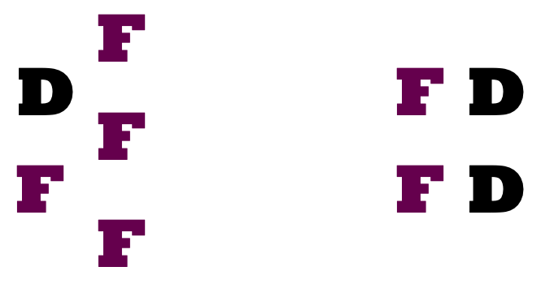
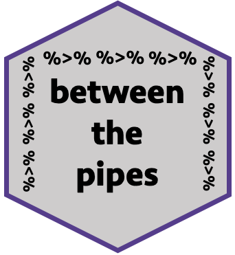
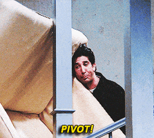

```{r setup, include=FALSE}
options(htmltools.dir.version = FALSE)
options(knitr.kable.NA = '')
knitr::opts_chunk$set(fig.retina = 3, 
                      warning = FALSE, 
                      message = FALSE,
                      fig.path = "figs/CMSAC/")

library(icon)
library(emo)
library(tidyverse)
library(betweenthepipes)
library(kableExtra)
library(janitor)
library(lubridate)
library(padr)

pbp <- pbp_example
bio <- bio_example %>%
  arrange(Player)
tracking <- track_example

CMSAC_theme <- function () { 
  theme_linedraw(base_size=11, base_family="opensans") %+replace% 
    theme(
      axis.ticks = element_blank(),
      panel.grid.minor = element_blank(),
      panel.grid.major = element_blank(),
      plot.title = element_text(size = 15, hjust = 0, vjust = 0.5, margin = margin(b = 0.2, unit = "cm")),
      plot.subtitle = element_text(size = 9, face = "italic", hjust = 0, vjust = 0.5, margin = margin(b = 0.2, unit = "cm")),
      axis.title = element_text(face = "bold"))
  }
```

```{r xaringan-themer, include=FALSE, warning=FALSE}
library(xaringanthemer)

style_mono_accent(
  header_font_google = google_font("Bebas Neue"),
  text_font_google   = google_font("Lato", "400", "400i"),
  code_font_google   = google_font("Roboto Mono"),
  base_color = "#5C164E",
  extra_fonts = list(
    google_font("Lato")
  ),
  extra_css = list(
    ".title-slide h2" = list("font-family" = "Lato"),
    ".title-slide h3" = list("font-family" = "Lato")
  )
)
```

# Me, Exceedingly Briefly

--

`r emo::ji("one")`&nbsp; I work in higher ed as a data manager.

<br>
<br>

--

`r emo::ji("two")`&nbsp; I dabble in hockey analysis.

<br>
<br>

--

`r emo::ji("three")`&nbsp; I use R a **lot**, thanks to `r emo::ji("one")` and `r emo::ji("two")`, and love helping other people learn.

<br>
<br>

---

# The Plan for Today

--

Do you need to know anything about hockey?

--

**No.**

---
background-image: url(https://pbs.twimg.com/media/D6gCaiyW0AAAwdf?format=jpg&name=large)
background-position: center
background-size: contain
class: center, inverse

---

# The Plan for Today

Do you need to know anything about hockey?

**No.**

<br>
<br>

Do you need to know anything about coding?

--

**Eh.**

---

# The Plan for Today


**GOAL**: "Level up your R programming and make your analysis more efficient."

--

<br>

`r emo::ji("one")`&nbsp; Data manipulation with `tidyr` and `dplyr` (and `stringr` and `lubridate` and `purrr`!)

--

`r emo::ji("two")`&nbsp; User-defined functions

--

`r emo::ji("three")`&nbsp; Custom `ggplot2` themes

<br>

--

`r emo::ji("clock")`&nbsp; 5-minute breaks at 5:00 and 5:30

--

`r emo::ji("question")`&nbsp; Questions!

<br>

--

**HOW**: Let's examine the composition of a power play.

---

class: center, middle

# Five-on-five

```{r, echo=FALSE, out.width=400, fig.align='center'}

```

---

class: center, middle

# Five-on-four with three forwards

```{r, echo=FALSE, out.width=400, fig.align='center'}

```

---

class: center, middle

# Five-on-four with four forwards

```{r, echo=FALSE, out.width=400, fig.align='center'}

```

---

# Two questions

--

`r emo::ji("one")`&nbsp; How does the positional composition change over the time of the power play?

<br>

(Is the four-forward configuration maybe more common at the beginning or the end of the power play?)

<br>

--

`r emo::ji("two")`&nbsp; Does a four-forward power play unit have a higher rate of zone exits?

---
class: inverse, center, middle

# Let's Get Set Up

---

# If you want to follow along

--

```{r, echo=FALSE, out.width=200, fig.align='center'}

```

--

```{r, eval=FALSE}
# Load the package
devtools::install_github("meghall06/betweenthepipes")
library(betweenthepipes)

# Load the data
pbp <- pbp_example
bio <- bio_example
tracking <- track_example
```

---

# Data sources

--

### Play-by-play data

- `pbp`: NHL play-by-play data
- Four Philadelphia Flyers games in November 2019
- Scraped via the [Evolving-Hockey]() R scraper

---

# Data sources

```{r, echo=FALSE}
pbp %>%
  select(game_id, game_date, event_index:event_description, event_team, event_length) %>%
  head(10) %>%
  kable("html") %>%
  kable_styling(font_size = 9.5, position = "left", full_width = F) %>%
  row_spec(0, bold = T, color = "white", background = "#5C164E")
```

---

# Data sources

```{r, echo=FALSE}
pbp %>%
  select(game_id, game_date, event_index:event_description, event_team, event_length) %>%
  head(10) %>%
  kable("html") %>%
  kable_styling(font_size = 9.5, position = "left", full_width = F) %>%
  row_spec(0, bold = T, color = "white", background = "#5C164E") %>%
  column_spec(c(1,3), bold = T, color = "white", background = "#5C164E")
```

---

# Data sources

```{r, echo=FALSE}
pbp %>%
  select(game_id, game_date, event_index:event_description, event_team, event_length) %>%
  head(10) %>%
  kable("html") %>%
  kable_styling(font_size = 9.5, position = "left", full_width = F) %>%
  row_spec(0, bold = T, color = "white", background = "#5C164E") %>%
  column_spec(c(5,9), bold = T, color = "white", background = "#5C164E")
```


---

# Data sources

```{r, echo=FALSE}
pbp %>%
  filter(game_strength_state %in% c("5v4", "4v5")) %>%
  select(game_strength_state, home_team, away_team, home_on_1:home_on_6) %>%
  head(10) %>%
  kable("html") %>%
  kable_styling(font_size = 9.5, position = "left", full_width = F) %>%
  row_spec(0, bold = T, color = "white", background = "#5C164E")

```

---

# Data sources

```{r, eval=FALSE}
pbp %>% 
  count(game_id, game_date, home_team, away_team)
```

```{r, echo=FALSE}
pbp %>% 
  count(game_id, game_date, home_team, away_team) %>%
  kable("html") %>%
  kable_styling(font_size = 20) %>%
  row_spec(0, bold = T, color = "white", background = "#5C164E")
```
---

# Data sources

### Play-by-play data

- `pbp`: NHL play-by-play data
- Four Philadelphia Flyers games in November 2019
- Scraped via the [Evolving-Hockey]() R scraper

### Skater Data

- `bio`: Demographic and position data for these players from 2019
- Downloaded from [Natural Stat Trick]()

---

# Data sources

```{r, echo=FALSE}
bio %>% 
  head(10) %>%
  select(Player:`Weight (lbs)`) %>%
  kable("html") %>%
  kable_styling(font_size = 15, position = "left", full_width = F) %>%
  row_spec(0, bold = T, color = "white", background = "#5C164E")
```

---

# Data sources

```{r, echo=FALSE}
bio %>% 
  head(10) %>%
  select(Player:`Weight (lbs)`) %>%
  kable("html") %>%
  kable_styling(font_size = 15, position = "left", full_width = F) %>%
  row_spec(0, bold = T, color = "white", background = "#5C164E") %>%
  column_spec(c(1, 2), bold = T, color = "white", background = "#5C164E")
```

---

# Data sources

### Play-by-play data

- `pbp`: NHL play-by-play data
- Four Philadelphia Flyers games in November 2019
- Scraped via the [Evolving-Hockey]() R scraper

### Skater Data

- `bio`: Demographic and position data for these players from 2019
- Downloaded from [Natural Stat Trick]()

### Tracking Data

- `tracking`: Zone exit data on the power play in these four games
- Personally tracked by me!

---

# Data sources

```{r, echo=FALSE, out.width=5}
tracking %>% 
  head(10) %>%
  kable("html") %>%
  kable_styling(font_size = 20, position = "left", full_width = F) %>%
  row_spec(0, bold = T, color = "white", background = "#5C164E")
```

---

# Data sources

```{r, echo=FALSE}
tracking %>% 
  head(10) %>%
  kable("html") %>%
  kable_styling(font_size = 20, position = "left", full_width = F) %>%
  row_spec(0, bold = T, color = "white", background = "#5C164E") %>%
  column_spec(c(3), bold = T, color = "white", background = "#5C164E")
```

---

# Data sources

### Play-by-play data

- `pbp`: NHL play-by-play data
- Four Philadelphia Flyers games in November 2019
- Scraped via the [Evolving-Hockey]() R scraper

### Skater Data

- `bio`: Demographic and position data for these players from 2019
- Downloaded from [Natural Stat Trick]()

### Tracking Data

- `tracking`: Zone exit data on the power play in these four games
- Personally tracked by me!

---
class: inverse, center, middle

# Plan of attack

---

# Plan of attack

`r emo::ji("monocle")`&nbsp; Study your different data sources

<br>
<br>
--

`r emo::ji("magnifying")`&nbsp; Find the relationships

<br>
<br>
--

`r emo::ji("pencil")`&nbsp; Sketch out how you want your data to look at the end

---

# Problems we get to solve

`r emo::ji("x")`&nbsp; Player position data is in a different place

<br>
<br>

--

`r emo::ji("x")`&nbsp; Zone exit data is in a different place

<br>
<br>

--

`r emo::ji("x")`&nbsp; One row per event instead of one row per second `r emo::ji("thinking")`

<br>
<br>

---

# Packages we'll be using

--

`r emo::ji("star")`&nbsp; My package (where the data is)

```{r, eval=FALSE}

library(betweenthepipes)

```
--
`r emo::ji("heart")`&nbsp; The tidyverse (aka `dplyr`, `tidyr`, `ggplot2`, `stringr`)

```{r, eval=FALSE}

library(tidyverse)

```
--
`r emo::ji("clock")`&nbsp; For dealing with time (also part of the tidyverse)

```{r, eval=FALSE}

library(lubridate)

```
--
`r emo::ji("broom")`&nbsp; For some data cleaning help

```{r, eval=FALSE}

library(janitor)

```

--
`r emo::ji("clockwise")`&nbsp; For padding out our data

```{r, eval=FALSE}

library(padr)

```

---
class: inverse, center, middle

# Play by play data
---

# Play by play data

```{r, eval=FALSE}
power <- pbp %>%
  # filter to only the power play strength states
  filter(game_strength_state %in% c("5v4", "4v5")) %>%
  # filter to only events that have time associated with them
  filter(event_length > 0) %>%
  # create a new variable that designates the PP team
  mutate(PP_team = ifelse(game_strength_state == "5v4", 
                          home_team, away_team)) %>%
  # create a new set of variables to determine who the PP players are
  mutate(PP_1 = ifelse(home_team == PP_team, home_on_1, away_on_1),
         PP_2 = ifelse(home_team == PP_team, home_on_2, away_on_2),
         PP_3 = ifelse(home_team == PP_team, home_on_3, away_on_3),
         PP_4 = ifelse(home_team == PP_team, home_on_4, away_on_4),
         PP_5 = ifelse(home_team == PP_team, home_on_5, away_on_5),
         PP_6 = ifelse(home_team == PP_team, home_on_6, away_on_6))
```

---

# Play by play data

```{r, tidy=FALSE}
power <- pbp %>%
  # filter to only the power play strength states
  filter(game_strength_state %in% c("5v4", "4v5")) %>% #<<
  # filter to only events that have time associated with them
  filter(event_length > 0) %>%
  # create a new variable that designates the PP team
  mutate(PP_team = ifelse(game_strength_state == "5v4", 
                          home_team, away_team)) %>%
  # create a new set of variables to determine who the PP players are
  mutate(PP_1 = ifelse(home_team == PP_team, home_on_1, away_on_1),
         PP_2 = ifelse(home_team == PP_team, home_on_2, away_on_2),
         PP_3 = ifelse(home_team == PP_team, home_on_3, away_on_3),
         PP_4 = ifelse(home_team == PP_team, home_on_4, away_on_4), 
         PP_5 = ifelse(home_team == PP_team, home_on_5, away_on_5),
         PP_6 = ifelse(home_team == PP_team, home_on_6, away_on_6))
```

---

# Play by play data

```{r, tidy=FALSE}
power <- pbp %>%
  # filter to only the power play strength states
  filter(game_strength_state %in% c("5v4", "4v5")) %>% 
  # filter to only events that have time associated with them
  filter(event_length > 0) %>% #<<
  # create a new variable that designates the PP team
  mutate(PP_team = ifelse(game_strength_state == "5v4", 
                          home_team, away_team)) %>%
  # create a new set of variables to determine who the PP players are
  mutate(PP_1 = ifelse(home_team == PP_team, home_on_1, away_on_1),
         PP_2 = ifelse(home_team == PP_team, home_on_2, away_on_2),
         PP_3 = ifelse(home_team == PP_team, home_on_3, away_on_3),
         PP_4 = ifelse(home_team == PP_team, home_on_4, away_on_4), 
         PP_5 = ifelse(home_team == PP_team, home_on_5, away_on_5),
         PP_6 = ifelse(home_team == PP_team, home_on_6, away_on_6))
```

---

# Play by play data

```{r, tidy=FALSE}
power <- pbp %>%
  # filter to only the power play strength states
  filter(game_strength_state %in% c("5v4", "4v5")) %>% 
  # filter to only events that have time associated with them
  filter(event_length > 0) %>% 
  # create a new variable that designates the PP team
  mutate(PP_team = ifelse(game_strength_state == "5v4", #<<
                          home_team, away_team)) %>%    #<<
  # create a new set of variables to determine who the PP players are
  mutate(PP_1 = ifelse(home_team == PP_team, home_on_1, away_on_1),
         PP_2 = ifelse(home_team == PP_team, home_on_2, away_on_2),
         PP_3 = ifelse(home_team == PP_team, home_on_3, away_on_3),
         PP_4 = ifelse(home_team == PP_team, home_on_4, away_on_4), 
         PP_5 = ifelse(home_team == PP_team, home_on_5, away_on_5),
         PP_6 = ifelse(home_team == PP_team, home_on_6, away_on_6))
```

---

# Play by play data

```{r, tidy=FALSE}
power <- pbp %>%
  # filter to only the power play strength states
  filter(game_strength_state %in% c("5v4", "4v5")) %>% 
  # filter to only events that have time associated with them
  filter(event_length > 0) %>% 
  # create a new variable that designates the PP team
  mutate(PP_team = ifelse(game_strength_state == "5v4", 
                          home_team, away_team)) %>%
  # create a new set of variables to determine who the PP players are
  mutate(PP_1 = ifelse(home_team == PP_team, home_on_1, away_on_1), #<<
         PP_2 = ifelse(home_team == PP_team, home_on_2, away_on_2), #<<
         PP_3 = ifelse(home_team == PP_team, home_on_3, away_on_3), #<<
         PP_4 = ifelse(home_team == PP_team, home_on_4, away_on_4), #<<
         PP_5 = ifelse(home_team == PP_team, home_on_5, away_on_5), #<<
         PP_6 = ifelse(home_team == PP_team, home_on_6, away_on_6)) #<<
```

---

# Play by play data

```{r, echo=FALSE}
power %>%
  select(game_id, event_index, PP_team, PP_1:PP_6) %>%
  head(10) %>%
  kable("html") %>%
  kable_styling(font_size = 10, position = "left", full_width = F) %>%
  row_spec(0, bold = T, color = "white", background = "#5C164E")
```

---
class: middle, inverse

```{r, echo=FALSE, out.width=600, fig.align='center'}

```

---

# Play by play data

```{r, tidy=FALSE}
pivot <- power %>%
  # pick the variables that we want
  select(game_id, event_index, PP_team, game_seconds, event_length, #<<
         home_goalie, away_goalie, PP_1:PP_6) %>%                   #<<
  # pivot the six player variables
  pivot_longer(PP_1:PP_6, 
               names_to = "on_ice", 
               values_to = "player") %>%
  # filter out the goalies
  filter(player != home_goalie & player != away_goalie) %>%
  # remove the now-unnecessary goalie variables
  select(-c(home_goalie, away_goalie, on_ice))
```

---

# Play by play data

```{r, tidy=FALSE}
pivot <- power %>%
  # pick the variables that we want
  select(game_id, event_index, PP_team, game_seconds, event_length,
         home_goalie, away_goalie, PP_1:PP_6) %>%                   
  # pivot the six player variables
  pivot_longer(PP_1:PP_6, #<<
               names_to = "on_ice", #<<
               values_to = "player") %>% #<<
  # filter out the goalies
  filter(player != home_goalie & player != away_goalie) %>%
  # remove the now-unnecessary goalie variables
  select(-c(home_goalie, away_goalie, on_ice))
```

---

# Play by play data

```{r, echo=FALSE}
power %>%
  # pick the variables that we want
  select(game_id, event_index, PP_team, game_seconds, event_length,
         home_goalie, away_goalie, PP_1:PP_6) %>%                   
  # pivot the six player variables
  pivot_longer(PP_1:PP_6, names_to = "on_ice", values_to = "player") %>%
  head(12) %>%
  kable("html") %>%
  kable_styling(font_size = 12, position = "left", full_width = F) %>%
  row_spec(0, bold = T, color = "white", background = "#5C164E")
```

---

# Play by play data

```{r, echo=FALSE}
power %>%
  # pick the variables that we want
  select(game_id, event_index, PP_team, game_seconds, event_length,
         home_goalie, away_goalie, PP_1:PP_6) %>%                   
  # pivot the six player variables
  pivot_longer(PP_1:PP_6, names_to = "on_ice", values_to = "player") %>%
  head(12) %>%
  kable("html") %>%
  kable_styling(font_size = 12, position = "left", full_width = F) %>%
  row_spec(0, bold = T, color = "white", background = "#5C164E") %>%
  column_spec(c(2,8,9), bold = T, color = "white", background = "#5C164E")
```

---

# Play by play data

```{r, echo=FALSE}
power %>%
  # pick the variables that we want
  select(game_id, event_index, PP_team, game_seconds, event_length,
         home_goalie, away_goalie, PP_1:PP_6) %>%                   
  # pivot the six player variables
  pivot_longer(PP_1:PP_6, names_to = "on_ice", values_to = "player") %>%
  head(12) %>%
  kable("html") %>%
  kable_styling(font_size = 12, position = "left", full_width = F) %>%
  row_spec(0, bold = T, color = "white", background = "#5C164E") %>%
  row_spec(c(3,9), bold = T, color = "white", background = "#5C164E")
```

---

# Play by play data

```{r, tidy=FALSE}
pivot <- power %>%
  # pick the variables that we want
  select(game_id, event_index, PP_team, game_seconds, event_length,
         home_goalie, away_goalie, PP_1:PP_6) %>%                   
  # pivot the six player variables
  pivot_longer(PP_1:PP_6, 
               names_to = "on_ice", 
               values_to = "player") %>% 
  # filter out the goalies
  filter(player != home_goalie & player != away_goalie) %>% #<<
  # remove the now-unnecessary goalie variables
  select(-c(home_goalie, away_goalie, on_ice))
```

---

# Play by play data

```{r, tidy=FALSE}
pivot <- power %>%
  # pick the variables that we want
  select(game_id, event_index, PP_team, game_seconds, event_length,
         home_goalie, away_goalie, PP_1:PP_6) %>%                   
  # pivot the six player variables
  pivot_longer(PP_1:PP_6,
               names_to = "on_ice",
               values_to = "player") %>% 
  # filter out the goalies
  filter(player != home_goalie & player != away_goalie) %>%
  # remove the now-unnecessary goalie variables
  select(-c(home_goalie, away_goalie, on_ice)) #<<
```

---

# Play by play data

```{r, echo=FALSE}
pivot %>%
  head(10) %>%
  kable("html") %>%
  kable_styling(font_size = 12, position = "left", full_width = F) %>%
  row_spec(0, bold = T, color = "white", background = "#5C164E")
```

---

class: inverse, center, middle

# Skater data

---

# Skater data

``` {r, eval=FALSE}
bio <- bio %>%
  # reformat the variable names
  clean_names() %>%
  # use two stringr functions to convert our player names to all 
  # uppercase and replace the first space with a period
  mutate(player = str_to_upper(player),
         player = str_replace(player, " ", ".")) %>%
  # record our position variable into a 0/1 variable for forward
  mutate(forward = ifelse(position == "D", 0, 1)) %>%
  # select only these two variables
  select(player, forward)
```

---

# Skater data

``` {r, tidy=FALSE, eval=FALSE}
bio <- bio %>%
  # reformat the variable names
  clean_names() %>% #<<
  # use two stringr functions to convert our player names to all 
  # uppercase and replace the first space with a period
  mutate(player = str_to_upper(player),
         player = str_replace(player, " ", ".")) %>%
  # record our position variable into a 0/1 variable for forward
  mutate(forward = ifelse(position == "D", 0, 1)) %>%
  # select only these two variables
  select(player, forward)
```

---

# Skater data

```{r, echo=FALSE}
bio %>% 
  head(10) %>%
  select(Player:`Weight (lbs)`) %>%
  kable("html") %>%
  kable_styling(font_size = 15, position = "left", full_width = F) %>%
  row_spec(0, bold = T, color = "white", background = "#5C164E")
```

---

# Skater data

```{r, echo=FALSE}
bio %>% 
  head(10) %>%
  select(Player:`Height (in)`) %>%
  clean_names() %>%
  kable("html") %>%
  kable_styling(font_size = 15, position = "left", full_width = F) %>%
  row_spec(0, bold = T, color = "white", background = "#5C164E")
```

---

# Skater data

``` {r, tidy=FALSE, eval=FALSE}
bio <- bio %>%
  # reformat the variable names
  clean_names() %>%
  # use two stringr functions to convert our player names to all 
  # uppercase and replace the first space with a period
  mutate(player = str_to_upper(player), #<<
         player = str_replace(player, " ", ".")) %>% #<<
  # record our position variable into a 0/1 variable for forward
  mutate(forward = ifelse(position == "D", 0, 1)) %>%
  # select only these two variables
  select(player, forward)
```

---

# Skater data

```{r, echo=FALSE}
bio %>% 
  head(10) %>%
  select(Player:`Nationality`) %>%
  clean_names() %>%
  mutate(player = str_to_upper(player), #<<
         player = str_replace(player, " ", ".")) %>%
  kable("html") %>%
  kable_styling(font_size = 15, position = "left", full_width = F) %>%
  row_spec(0, bold = T, color = "white", background = "#5C164E") %>%
  column_spec(1, bold = T, color = "white", background = "#5C164E")
```

---

# Skater data

```{r, echo=FALSE}
bio %>% 
  head(10) %>%
  select(Player:`Nationality`) %>%
  clean_names() %>%
  mutate(player = str_to_upper(player), #<<
         player = str_replace(player, " ", ".")) %>%
  kable("html") %>%
  kable_styling(font_size = 15, position = "left", full_width = F) %>%
  row_spec(0, bold = T, color = "white", background = "#5C164E") %>%
  column_spec(2, bold = T, color = "white", background = "#5C164E")
```

---

# Skater data

``` {r, tidy=FALSE, eval=FALSE}
bio <- bio %>%
  # reformat the variable names
  clean_names() %>%
  # use two stringr functions to convert our player names to all 
  # uppercase and replace the first space with a period
  mutate(player = str_to_upper(player),
         player = str_replace(player, " ", ".")) %>% 
  # record our position variable into a 0/1 variable for forward
  mutate(forward = ifelse(position == "D", 0, 1)) %>% #<<
  # select only these two variables
  select(player, forward)
```

---

# Skater data

``` {r, tidy=FALSE}
bio <- bio %>%
  # reformat the variable names
  clean_names() %>%
  # use two stringr functions to convert our player names to all 
  # uppercase and replace the first space with a period
  mutate(player = str_to_upper(player),
         player = str_replace(player, " ", ".")) %>% 
  # record our position variable into a 0/1 variable for forward
  mutate(forward = ifelse(position == "D", 0, 1)) %>% 
  # select only these two variables
  select(player, forward) #<<
```

---

# Skater data

```{r, echo=FALSE}
bio %>% 
  head(10) %>%
  kable("html") %>%
  kable_styling(font_size = 15, position = "left", full_width = F) %>%
  row_spec(0, bold = T, color = "white", background = "#5C164E")
```

---

# Skater data

```{r}
pivot_position <- pivot %>%
  left_join(bio, by = "player")
```

--

```{r, echo=FALSE}
pivot_position %>%
  head(10) %>%
  kable("html") %>%
  kable_styling(font_size = 15, position = "left", full_width = F) %>%
  row_spec(0, bold = T, color = "white", background = "#5C164E")
```

---

# Skater data

```{r}
pivot_position %>%
  get_dupes(game_id, event_index, player)
```

---

# Skater data

```{r}
fixes <- pivot_position %>%
  filter(is.na(forward)) %>%
  count(player) %>%
  arrange(player)
```

--

```{r, echo=FALSE}
fixes %>%
  kable("html") %>%
  kable_styling(font_size = 15, position = "left", full_width = F) %>%
  row_spec(0, bold = T, color = "white", background = "#5C164E")
```


---

# Skater data

```{r, eval=FALSE}
bio %>%
  filter(str_detect(player, 'EDLER|WENNBERG|TANEV'))
```

--

```{r, echo=FALSE}
bio %>%
  filter(str_detect(player, 'EDLER|WENNBERG|TANEV')) %>%
  kable("html") %>%
  kable_styling(font_size = 15, position = "left", full_width = F) %>%
  row_spec(0, bold = T, color = "white", background = "#5C164E")
```

---

# Skater data

```{r}
bio <- bio %>%
  mutate(player = case_when(
                      player == "ALEXANDER.EDLER" ~ "ALEX.EDLER",
                      player == "ALEXANDER.WENNBERG" ~ "ALEX.WENNBERG",
                      player == "CHRISTOPHER.TANEV" ~ "CHRIS.TANEV",
                      TRUE ~ player))
```

--

```{r}
pivot_position <- pivot %>%
  left_join(bio, by = "player")

fixes <- pivot_position %>%
  filter(is.na(forward)) %>%
  count(player) %>%
  arrange(player)
```

--

```{r, echo=FALSE}
fixes %>%
  kable("html") %>%
  kable_styling(font_size = 15, position = "left", full_width = F) %>%
  row_spec(0, bold = T, color = "white", background = "#5C164E")
```

---

# Play by play

```{r, echo=FALSE}
pivot_position %>%
  head(10) %>%
  kable("html") %>%
  kable_styling(font_size = 15, position = "left", full_width = F) %>%
  row_spec(0, bold = T, color = "white", background = "#5C164E")
```

---
class: middle, inverse

```{r, echo=FALSE, out.width=600, fig.align='center'}

```

---

# Play by play

```{r, eval=FALSE}
data <- pivot_position %>%
  # first create a basic count variable for each player within a PP
  group_by(game_id, event_index) %>%
  mutate(on_ice = row_number()) %>%
  ungroup() %>%
  # pivot the players and positions
  pivot_wider(names_from = "on_ice", 
              values_from = c("player", "forward")) %>%
  # create a variable to count the number of forwards
  mutate(PP_fwds = select(., forward_1:forward_5) %>% 
           rowSums(na.rm = TRUE)) %>%
  # remove the now-unnecessary variables
  select(-c(player_1:forward_5))
```

---

# Play by play

```{r, eval=FALSE, tidy=FALSE}
data <- pivot_position %>%
  # first create a basic count variable for each player within a PP
  group_by(game_id, event_index) %>% #<<
  mutate(on_ice = row_number()) %>% #<<
  ungroup() %>% #<<
  # pivot the players and positions
  pivot_wider(names_from = "on_ice", 
              values_from = c("player", "forward")) %>%
  # create a variable to count the number of forwards
  mutate(PP_fwds = select(., forward_1:forward_5) %>% 
           rowSums(na.rm = TRUE)) %>%
  # remove the now-unnecessary variables
  select(-c(player_1:forward_5))
```

---

# Play by play

```{r, echo=FALSE}
pivot_position %>%
  group_by(game_id, event_index) %>%
  mutate(on_ice = row_number()) %>% 
  ungroup() %>%
  head(10) %>%
  kable("html") %>%
  kable_styling(font_size = 15, position = "left", full_width = F) %>%
  row_spec(0, bold = T, color = "white", background = "#5C164E") %>%
  column_spec(8, bold = T, color = "white", background = "#5C164E")
```

---

# Play by play

```{r, eval=FALSE, tidy=FALSE}
data <- pivot_position %>%
  # first create a basic count variable for each player within a PP
  group_by(game_id, event_index) %>%
  mutate(on_ice = row_number()) %>%
  ungroup() %>% 
  # pivot the players and positions
  pivot_wider(names_from = "on_ice", #<<
              values_from = c("player", "forward")) %>% #<<
  # create a variable to count the number of forwards
  mutate(PP_fwds = select(., forward_1:forward_5) %>% 
           rowSums(na.rm = TRUE)) %>%
  # remove the now-unnecessary variables
  select(-c(player_1:forward_5))
```

---

# Play by play

```{r, echo=FALSE}
pivot_position %>%
  group_by(game_id, event_index) %>%
  mutate(on_ice = row_number()) %>% 
  ungroup() %>%
  pivot_wider(names_from = "on_ice", #<<
              values_from = c("player", "forward")) %>%
  select(game_id:player_1, forward_1, player_2, forward_2) %>%
  head(10) %>%
  kable("html") %>%
  kable_styling(font_size = 12, position = "left", full_width = F) %>%
  row_spec(0, bold = T, color = "white", background = "#5C164E") %>%
  column_spec(6:9, bold = T, color = "white", background = "#5C164E")
```

---

# Play by play

```{r, eval=FALSE, tidy=FALSE}
data <- pivot_position %>%
  # first create a basic count variable for each player within a PP
  group_by(game_id, event_index) %>%
  mutate(on_ice = row_number()) %>%
  ungroup() %>% 
  # pivot the players and positions
  pivot_wider(names_from = "on_ice", 
              values_from = c("player", "forward")) %>%
  # create a variable to count the number of forwards
  mutate(PP_fwds = select(., forward_1:forward_5) %>% #<<
           rowSums(na.rm = TRUE)) %>% #<<
  # remove the now-unnecessary variables
  select(-c(player_1:forward_5))
```

---

# Play by play

```{r, tidy=FALSE}
data <- pivot_position %>%
  # first create a basic count variable for each player within a PP
  group_by(game_id, event_index) %>%
  mutate(on_ice = row_number()) %>%
  ungroup() %>% 
  # pivot the players and positions
  pivot_wider(names_from = "on_ice", 
              values_from = c("player", "forward")) %>%
  # create a variable to count the number of forwards
  mutate(PP_fwds = select(., forward_1:forward_5) %>% 
           rowSums(na.rm = TRUE)) %>%
  # remove the now-unnecessary variables
  select(-c(player_1:forward_5)) #<<
```

---

# Play by play

```{r, echo=FALSE}
data %>%
  head(10) %>%
  kable("html") %>%
  kable_styling(font_size = 20, position = "left", full_width = F) %>%
  row_spec(0, bold = T, color = "white", background = "#5C164E") %>%
  column_spec(6, bold = T, color = "white", background = "#5C164E")
```

---

# Problems we get to solve

`r emo::ji("check")`&nbsp; Player position data is in a different place

<br>
<br>

`r emo::ji("x")`&nbsp; Zone exit data is in a different place

<br>
<br>

`r emo::ji("x")`&nbsp; One row per event instead of one row per second `r emo::ji("thinking")`

---

class: inverse, center, middle

# Tracking data

---

# Tracking data

```{r, echo=FALSE}
tracking %>% 
  head(10) %>%
  kable("html") %>%
  kable_styling(font_size = 20, position = "left", full_width = F) %>%
  row_spec(0, bold = T, color = "white", background = "#5C164E") %>%
  column_spec(3, bold = T, color = "white", background = "#5C164E")
```

---

# Tracking data

```{r, eval=FALSE}
tracking <- tracking %>%
  # create a new variable that converts to m:s
  mutate(time_new = str_sub(time, 1, 5),
         time_new = ms(time_new),
         # create a new variable for total seconds
         seconds = minute(time_new)*60 + second(time_new),
         # create a game_seconds variable to match what's in pbp data
         game_seconds = case_when(
                            game_period == 1 ~ 1200 - seconds,
                            game_period == 2 ~ 2400 - seconds,
                            game_period == 3 ~ 3600 - seconds)) %>%
  # remove now-unnecessary variables
  select(-c(time, time_new, seconds, game_period))
```

---

# Tracking data

```{r, eval=FALSE, tidy=FALSE}
tracking <- tracking %>%
  # create a new variable that converts to m:s
  mutate(time_new = str_sub(time, 1, 5), #<<
         time_new = ms(time_new), #<<
         # create a new variable for total seconds
         seconds = minute(time_new)*60 + second(time_new),
         # create a game_seconds variable to match what's in pbp data
         game_seconds = case_when(
                            game_period == 1 ~ 1200 - seconds,
                            game_period == 2 ~ 2400 - seconds,
                            game_period == 3 ~ 3600 - seconds)) %>%
  # remove now-unnecessary variables
  select(-c(time, time_new, seconds, game_period))
```

---

# Tracking data

```{r, echo=FALSE}
tracking %>% 
  mutate(time_new = str_sub(time, 1, 5),
         time_new = ms(time_new)) %>%
  head(10) %>%
  kable("html") %>%
  kable_styling(font_size = 20, position = "left", full_width = F) %>%
  row_spec(0, bold = T, color = "white", background = "#5C164E") %>%
  column_spec(5, bold = T, color = "white", background = "#5C164E")
```

---

# Tracking data

```{r, eval=FALSE, tidy=FALSE}
tracking <- tracking %>%
  # create a new variable that converts to m:s
  mutate(time_new = str_sub(time, 1, 5),
         time_new = ms(time_new), 
         # create a new variable for total seconds
         seconds = minute(time_new)*60 + second(time_new), #<<
         # create a game_seconds variable to match what's in pbp data
         game_seconds = case_when(
                            game_period == 1 ~ 1200 - seconds,
                            game_period == 2 ~ 2400 - seconds,
                            game_period == 3 ~ 3600 - seconds)) %>%
  # remove now-unnecessary variables
  select(-c(time, time_new, seconds, game_period))
```

---

# Tracking data

```{r, echo=FALSE}
tracking %>% 
  mutate(time_new = str_sub(time, 1, 5),
         time_new = ms(time_new),
         seconds = minute(time_new)*60 + second(time_new)) %>%
  head(10) %>%
  kable("html") %>%
  kable_styling(font_size = 20, position = "left", full_width = F) %>%
  row_spec(0, bold = T, color = "white", background = "#5C164E")  %>%
  column_spec(6, bold = T, color = "white", background = "#5C164E")
```

---

# Tracking data

```{r, tidy=FALSE}
tracking <- tracking %>%
  # create a new variable that converts to m:s
  mutate(time_new = str_sub(time, 1, 5),
         time_new = ms(time_new), 
         # create a new variable for total seconds
         seconds = minute(time_new)*60 + second(time_new), 
         # create a game_seconds variable to match what's in pbp data
         game_seconds = case_when( #<<
                            game_period == 1 ~ 1200 - seconds, #<<
                            game_period == 2 ~ 2400 - seconds, #<<
                            game_period == 3 ~ 3600 - seconds)) %>% #<<
  # remove now-unnecessary variables
  select(-c(time, time_new, seconds, game_period))
```

---

# Tracking data

```{r, echo=FALSE}
tracking %>% 
  head(10) %>%
  kable("html") %>%
  kable_styling(font_size = 20, position = "left", full_width = F) %>%
  row_spec(0, bold = T, color = "white", background = "#5C164E")  %>%
  column_spec(3, bold = T, color = "white", background = "#5C164E")
```

---

class: middle, center, inverse

# Padding our data

---

# What's the goal?

We want to expand our data: one row per event `r emo::ji("right arrow")`&nbsp; one row per second

<br>
<br>
--

So we can more easily:

`r emo::ji("one")`&nbsp; Examine the average composition of a power play per second

`r emo::ji("two")`&nbsp; Join in our manually-tracked data

<br>
<br>
--

Thankfully, we have the `padr` package.

---

# Padding our data

```{r, eval=FALSE, tidy=FALSE}
data <- data %>%
  # create an 0/1 variable to identify a new power play
  # and a power_play_count variable
  mutate(new_power_play = ifelse(lag(game_seconds + event_length) == 
                                   game_seconds & lag(PP_team) == 
                                   PP_team, 0, 1),
         new_power_play = ifelse(is.na(new_power_play), 
                                 1, new_power_play),
         power_play_count = cumsum(new_power_play)) %>%
  select(power_play_count, everything())
```

---

# Padding our data

```{r, eval=FALSE, tidy=FALSE}
data <- data %>%
  # create an 0/1 variable to identify a new power play
  # and a power_play_count variable
  mutate(new_power_play = ifelse(lag(game_seconds + event_length) == #<<
                                   game_seconds & lag(PP_team) == #<<
                                   PP_team, 0, 1), #<<
         new_power_play = ifelse(is.na(new_power_play), #<<
                                 1, new_power_play), #<<
         power_play_count = cumsum(new_power_play)) %>%
  select(power_play_count, everything())
```

---

# Padding our data

```{r, echo=FALSE}
data %>%
  # create an 0/1 variable to identify a new power play
  # and a power_play_count variable
  mutate(new_power_play = ifelse(lag(game_seconds + event_length) == game_seconds & lag(PP_team) == PP_team, 0, 1),
         new_power_play = ifelse(is.na(new_power_play), 1, new_power_play)) %>%
  head(10) %>%
  kable("html") %>%
  kable_styling(font_size = 18, position = "left", full_width = F) %>%
  row_spec(c(0, 1, 7), bold = T, color = "white", background = "#5C164E")
```

---

# Padding our data

```{r, eval=FALSE, tidy=FALSE}
data <- data %>%
  # create an 0/1 variable to identify a new power play
  # and a power_play_count variable
  mutate(new_power_play = ifelse(lag(game_seconds + event_length) == 
                                   game_seconds & lag(PP_team) ==
                                   PP_team, 0, 1), 
         new_power_play = ifelse(is.na(new_power_play), 
                                 1, new_power_play), 
         power_play_count = cumsum(new_power_play)) %>% #<<
  select(power_play_count, everything())
```

---

# Padding our data

```{r, echo=FALSE}
data %>%
  # create an 0/1 variable to identify a new power play
  # and a power_play_count variable
  mutate(new_power_play = ifelse(lag(game_seconds + event_length) == game_seconds & lag(PP_team) == PP_team, 0, 1),
         new_power_play = ifelse(is.na(new_power_play), 1, new_power_play),
         power_play_count = cumsum(new_power_play)) %>%
  head(10) %>%
  kable("html") %>%
  kable_styling(font_size = 14, position = "left", full_width = F) %>%
  row_spec(0, bold = T, color = "white", background = "#5C164E")  %>%
  column_spec(8, bold = T, color = "white", background = "#5C164E")
```

---

# Padding our data

```{r, tidy=FALSE}
data <- data %>%
  # create an 0/1 variable to identify a new power play
  # and a power_play_count variable
  mutate(new_power_play = ifelse(lag(game_seconds + event_length) == 
                                   game_seconds & lag(PP_team) ==
                                   PP_team, 0, 1), 
         new_power_play = ifelse(is.na(new_power_play), 
                                 1, new_power_play), 
         power_play_count = cumsum(new_power_play)) %>% 
  select(power_play_count, everything()) #<<
```

---

# Padding our data

```{r, echo=FALSE}
data %>%
  head(10) %>%
  kable("html") %>%
  kable_styling(font_size = 14, position = "left", full_width = F) %>%
  row_spec(0, bold = T, color = "white", background = "#5C164E") %>%
  column_spec(1, bold = T, color = "white", background = "#5C164E")
```

---

# Let's do a test

```{r, eval=FALSE, tidy=FALSE}
sample <- data %>%
  filter(power_play_count == 1) %>%
  pad_int('game_seconds',
          start_val = 234,
          end_val = 283) %>%
  fill(power_play_count, game_id, PP_team, PP_fwds, 
       .direction = "down")
```

---

# Let's do a test

```{r, eval=FALSE, tidy=FALSE}
sample <- data %>%
  filter(power_play_count == 1) %>% #<<
  pad_int('game_seconds',
          start_val = 234,
          end_val = 283) %>%
  fill(power_play_count, game_id, PP_team, PP_fwds, 
       .direction = "down")
```

---

# Let's do a test

```{r, echo=FALSE}
data %>%
  filter(power_play_count == 1) %>%
  kable("html") %>%
  kable_styling(font_size = 14, position = "left", full_width = F) %>%
  row_spec(0, bold = T, color = "white", background = "#5C164E")
```

---

# Let's do a test

```{r, echo=FALSE}
data %>%
  filter(power_play_count == 1) %>%
  kable("html") %>%
  kable_styling(font_size = 14, position = "left", full_width = F) %>%
  row_spec(0:1, bold = T, color = "white", background = "#5C164E")
```

---

# Let's do a test

```{r, echo=FALSE}
data %>%
  filter(power_play_count == 1) %>%
  kable("html") %>%
  kable_styling(font_size = 14, position = "left", full_width = F) %>%
  row_spec(c(0,6), bold = T, color = "white", background = "#5C164E")
```

---

# Let's do a test

```{r, eval=FALSE, tidy=FALSE}
sample <- data %>%
  filter(power_play_count == 1) %>% 
  pad_int('game_seconds', #<<
          start_val = 234, #<<
          end_val = 283) %>% #<<
  fill(power_play_count, game_id, PP_team, PP_fwds, 
       .direction = "down")
```

---

# Let's do a test

```{r, echo=FALSE}
data %>%
  filter(power_play_count == 1) %>%
  pad_int('game_seconds',
          start_val = 234,
          end_val = 283) %>%
  head(10) %>%
  kable("html") %>%
  kable_styling(font_size = 14, position = "left", full_width = F) %>%
  row_spec(0, bold = T, color = "white", background = "#5C164E")
```

---

# Let's do a test

```{r, echo=FALSE}
data %>%
  filter(power_play_count == 1) %>%
  pad_int('game_seconds',
          start_val = 234,
          end_val = 283) %>%
  head(10) %>%
  kable("html") %>%
  kable_styling(font_size = 14, position = "left", full_width = F) %>%
  row_spec(0, bold = T, color = "white", background = "#5C164E") %>%
  column_spec(1, bold = T, color = "white", background = "#5C164E")
```

---

# Let's do a test

```{r, eval=FALSE, tidy=FALSE}
sample <- data %>%
  filter(power_play_count == 1) %>% 
  pad_int('game_seconds', 
          start_val = 234,
          end_val = 283) %>% 
  fill(power_play_count, game_id, PP_team, PP_fwds, #<<
       .direction = "down") #<<
```

---

# Let's do a test

```{r, echo=FALSE}
data %>%
  filter(power_play_count == 1) %>%
  pad_int('game_seconds',
          start_val = 234,
          end_val = 283) %>%
  fill(power_play_count, game_id, PP_team, PP_fwds,
       .direction = "down") %>%
  head(10) %>%
  kable("html") %>%
  kable_styling(font_size = 14, position = "left", full_width = F) %>%
  row_spec(0, bold = T, color = "white", background = "#5C164E")
```

---

# Let's do a test

```{r, echo=FALSE}
data %>%
  filter(power_play_count == 1) %>%
  pad_int('game_seconds',
          start_val = 234,
          end_val = 283) %>%
  fill(power_play_count, game_id, PP_team, PP_fwds,
       .direction = "down") %>%
  head(10) %>%
  kable("html") %>%
  kable_styling(font_size = 14, position = "left", full_width = F) %>%
  row_spec(0, bold = T, color = "white", background = "#5C164E") %>%
  column_spec(c(2, 3, 5, 7), bold = T, color = "white", background = "#5C164E")
```

---

# When is it time for a function?

--

`r emo::ji("grimace")`&nbsp; (Don't be scared like me.)

<br>

--

`r emo::ji("pencil")`&nbsp; You've copied and pasted code more than twice.

<br>

--

`r emo::ji("repeat")`&nbsp; You need to run multiple lines of code on different segments of data.

--

<br>

```{r, eval=FALSE}
# basic syntax of a function

name_of_function <- function(needed_value) {
  
  # all the code goes here
  
}

```

---

# Padding our data

```{r, tidy=FALSE}
padding_function <- function(count) {
  
  each_power_play <- data %>%
    filter(power_play_count == count)
  
  minimum <- min(each_power_play$game_seconds)
  maximum <- max(each_power_play$game_seconds + 
                   each_power_play$event_length - 1)
  
  padded <- each_power_play %>%
    pad_int('game_seconds',
            start_val = minimum,
            end_val = maximum) %>%
    fill(power_play_count, game_id, PP_team, PP_fwds, 
         .direction = "down")
}
```

---

# Padding our data

```{r, tidy=FALSE}
padding_function <- function(count) { #<<
  
  each_power_play <- data %>%
    filter(power_play_count == count)
  
  minimum <- min(each_power_play$game_seconds)
  maximum <- max(each_power_play$game_seconds + 
                   each_power_play$event_length - 1)
  
  padded <- each_power_play %>%
    pad_int('game_seconds',
            start_val = minimum,
            end_val = maximum) %>%
    fill(power_play_count, game_id, PP_team, PP_fwds, 
         .direction = "down")
}
```

---

# Padding our data

```{r, tidy=FALSE}
padding_function <- function(count) { 
  
  each_power_play <- data %>% #<<
    filter(power_play_count == count) #<<
  
  minimum <- min(each_power_play$game_seconds)
  maximum <- max(each_power_play$game_seconds + 
                   each_power_play$event_length - 1)
  
  padded <- each_power_play %>%
    pad_int('game_seconds',
            start_val = minimum,
            end_val = maximum) %>%
    fill(power_play_count, game_id, PP_team, PP_fwds, 
         .direction = "down")
}
```

---

# Padding our data

```{r, tidy=FALSE}
padding_function <- function(count) { 
  
  each_power_play <- data %>% 
    filter(power_play_count == count)
  
  minimum <- min(each_power_play$game_seconds) #<<
  maximum <- max(each_power_play$game_seconds + #<< 
                   each_power_play$event_length - 1) #<<
  
  padded <- each_power_play %>%
    pad_int('game_seconds',
            start_val = minimum,
            end_val = maximum) %>%
    fill(power_play_count, game_id, PP_team, PP_fwds, 
         .direction = "down")
}
```

---

# Padding our data

```{r, tidy=FALSE}
padding_function <- function(count) { 
  
  each_power_play <- data %>% 
    filter(power_play_count == count)
  
  minimum <- min(each_power_play$game_seconds) 
  maximum <- max(each_power_play$game_seconds +
                   each_power_play$event_length - 1)
  
  padded <- each_power_play %>% #<<
    pad_int('game_seconds', #<<
            start_val = minimum, #<<
            end_val = maximum) %>% #<<
    fill(power_play_count, game_id, PP_team, PP_fwds, #<< 
         .direction = "down") #<<
}
```

---

# Padding our data

A common scenario:

<br>

--

`r emo::ji("scissors")`&nbsp; Split the data into pieces

<br>

--

`r emo::ji("repeat")`&nbsp; Apply a function to each piece

<br>

--

`r emo::ji("plus")`&nbsp; Put it back together

<br>

--

We can do this with the `map()` family of functions in the `purrr` package.

---

# Padding our data

```{r, tidy=FALSE}
data_padded <- 
  map_df(unique(data$power_play_count), padding_function)
```

--

`map_df` has two arguments: the data and the function

--

```{r, eval=FALSE}
unique(data$power_play_count)
```

We're telling it to perform the function for each unique value of `power_play_count` in the `data` data frame

--

It will apply our `padding_function` and return a data frame with the data padded

---

# Padding our data

```{r, echo=FALSE}
data_padded %>%
  head(10) %>%
  kable("html") %>%
  kable_styling(font_size = 14, position = "left", full_width = F) %>%
  row_spec(0, bold = T, color = "white", background = "#5C164E")
```

---

# Padding our data

```{r, echo=FALSE}
data_padded %>%
  tail(10) %>%
  kable("html") %>%
  kable_styling(font_size = 14, position = "left", full_width = F) %>%
  row_spec(0, bold = T, color = "white", background = "#5C164E")
```

---

# Padding our data

```{r}
data_final <- data_padded %>%
  group_by(power_play_count) %>%
  # add in a new variable for the second of 
  # each power play, counting up from 1
  mutate(power_play_second = row_number()) %>%
  ungroup()
```

---

# Padding our data

```{r, eval=FALSE, tidy=FALSE}
data_final <- data_padded %>%
  group_by(power_play_count) %>%
  # add in a new variable for the second of 
  # each power play, counting up from 1
  mutate(power_play_second = row_number()) %>%
  ungroup() #<<
```

---

# Padding our data

```{r, echo=FALSE}
data_final %>%
  head(10) %>%
  kable("html") %>%
  kable_styling(font_size = 12, position = "left", full_width = F) %>%
  row_spec(0, bold = T, color = "white", background = "#5C164E") %>%
  column_spec(9, bold = T, color = "white", background = "#5C164E")
```

--

```{r}
max(data_final$power_play_second)
```

---

# Problems we get to solve

`r emo::ji("check")`&nbsp; Player position data is in a different place

<br>
<br>

`r emo::ji("x")`&nbsp; Zone exit data is in a different place

<br>
<br>

`r emo::ji("check")`&nbsp; One row per event instead of one row per second `r emo::ji("thinking")`

---

# Tracking data

```{r}
data_final <- data_final %>%
  left_join(tracking, by = c("game_id", "game_seconds"))
```

---

# Tracking data

```{r, echo=FALSE}
data_final %>%
  head(10) %>%
  kable("html") %>%
  kable_styling(font_size = 12, position = "left", full_width = F) %>%
  row_spec(0, bold = T, color = "white", background = "#5C164E") %>%
  column_spec(10, bold = T, color = "white", background = "#5C164E")
```

--

```{r}
data_final %>% 
  get_dupes(game_id, game_seconds)
```

---

# Problems we get to solve

`r emo::ji("check")`&nbsp; Player position data is in a different place

<br>
<br>

`r emo::ji("check")`&nbsp; Zone exit data is in a different place

<br>
<br>

`r emo::ji("check")`&nbsp; One row per event instead of one row per second `r emo::ji("thinking")`

---

class: center, middle, inverse

<blockquote>
If you can't handle the data cleaning,
you don't deserve the data analysis.
.center[-- <cite>Me</cite>]
</blockquote>

---

class: center, middle, inverse

# Does a four-forward power play unit have a higher rate of zone exits?

---

# Summarizing our data

```{r, eval=FALSE, tidy=FALSE}
summary <- data_final %>%
  group_by(PP_fwds) %>%
  summarize(time_on_ice = sum(event_length, na.rm = TRUE) / 60,
            exits = sum(!is.na(event_type))) %>%
  mutate(exit_rate = exits * 60 / time_on_ice)
```

---

# Summarizing our data

```{r, eval=FALSE, tidy=FALSE}
summary <- data_final %>% 
  group_by(PP_fwds) %>% #<<
  summarize(time_on_ice = sum(event_length, na.rm = TRUE) / 60,
            exits = sum(!is.na(event_type))) %>%
  mutate(exit_rate = exits * 60 / time_on_ice)
```

---

# Summarizing our data

```{r, eval=FALSE, tidy=FALSE}
summary <- data_final %>%
  group_by(PP_fwds) %>%
  summarize(time_on_ice = sum(event_length, na.rm = TRUE) / 60, #<<
            exits = sum(!is.na(event_type))) %>%
  mutate(exit_rate = exits * 60 / time_on_ice)
```

---

# Summarizing our data

```{r, eval=FALSE, tidy=FALSE}
summary <- data_final %>%
  group_by(PP_fwds) %>%
  summarize(time_on_ice = sum(event_length, na.rm = TRUE) / 60, 
            exits = sum(!is.na(event_type))) %>% #<<
  mutate(exit_rate = exits * 60 / time_on_ice)
```

---

# Summarizing our data

```{r, tidy=FALSE}
summary <- data_final %>%
  group_by(PP_fwds) %>%
  summarize(time_on_ice = sum(event_length, na.rm = TRUE) / 60, 
            exits = sum(!is.na(event_type))) %>% 
  mutate(exit_rate = exits * 60 / time_on_ice) #<<
```

---

# Summarizing our data

```{r, eval=FALSE}
summary <- data_final %>%
  group_by(PP_fwds) %>%
  summarize(time_on_ice = sum(event_length, na.rm = TRUE) / 60, 
            exits = sum(!is.na(event_type))) %>% 
  mutate(exit_rate = exits * 60 / time_on_ice)
```

```{r, echo=FALSE}
summary %>%
  head(10) %>%
  kable("html") %>%
  kable_styling(font_size = 20, position = "left", full_width = F) %>%
  row_spec(0, bold = T, color = "white", background = "#5C164E")
```

---

class: center, middle, inverse

# Let's make a graph!

---

# The simplest graph

```{r, out.width = "70%", fig.height = 5, fig.align = "center"}
summary %>%
  ggplot(aes(x = as.character(PP_fwds), y = exit_rate)) +
  geom_bar(stat="identity")
```

---

# A little better

```{r, eval=FALSE, tidy=FALSE}
summary %>%
  ggplot(aes(x = as.character(PP_fwds), y = exit_rate)) +
  geom_bar(stat="identity") +
  labs(title = "Rate of zone exits on the power play", #<<
       subtitle = "5v4 only, 4 NHL games November 2019", #<<
       x = "Number of forwards on the power play", #<<
       y = "Zone exits per 60 minutes") + #<<
  geom_text(aes(label = round(exit_rate, 2)), vjust = 1.6, #<<
            color = "white", size = 4) #<<
```

---

# A little better

```{r, echo=FALSE, out.width = "70%", fig.height = 6, fig.align = "center"}
summary %>%
  ggplot(aes(x = as.character(PP_fwds), y = exit_rate)) +
  geom_bar(stat="identity") +
  labs(title = "Rate of zone exits on the power play",
       subtitle = "5v4 only, 4 NHL games November 2019",
       x = "Number of forwards on the power play", 
       y = "Zone exits per 60 minutes") +
  geom_text(aes(label = round(exit_rate, 2)), vjust = 1.6, color = "white", size = 4)
```

---

# With color!

```{r, eval=FALSE, tidy=FALSE}
summary %>%
  ggplot(aes(x = as.character(PP_fwds), y = exit_rate, 
             fill = as.character(PP_fwds))) + #<<
  geom_bar(stat="identity") +
  labs(title = "Rate of zone exits on the power play",
       subtitle = "5v4 only, 4 NHL games November 2019",
       x = "Number of forwards on the power play", 
       y = "Zone exits per 60 minutes") +
  geom_text(aes(label = round(exit_rate, 2)), vjust = 1.6, 
            color = "white", size = 4) +
  scale_fill_manual(values = c("#808080", "#5C164E")) + #<<
  theme(legend.position = "none")
```

---

# With color!

```{r, echo=FALSE, out.width = "70%", fig.height = 6, fig.align = "center"}
summary %>%
  ggplot(aes(x = as.character(PP_fwds), y = exit_rate, fill = as.character(PP_fwds))) +
  geom_bar(stat="identity") +
  labs(title = "Rate of zone exits on the power play",
       subtitle = "5v4 only, 4 NHL games November 2019",
       x = "Number of forwards on the power play", 
       y = "Zone exits per 60 minutes") +
  geom_text(aes(label = round(exit_rate, 2)), vjust = 1.6, color = "white", size = 4) +
  scale_fill_manual(values = c("#808080", "#5C164E")) +
  theme(legend.position = "none")
```

---

# Much better

```{r, eval=FALSE, tidy=FALSE}
summary %>%
  ggplot(aes(x = as.character(PP_fwds), y = exit_rate, 
             fill = as.character(PP_fwds))) +
  geom_bar(stat="identity") +
  labs(title = "Rate of zone exits on the power play",
       subtitle = "5v4 only, 4 NHL games November 2019",
       x = "Number of forwards on the power play", 
       y = "Zone exits per 60 minutes") +
  geom_text(aes(label = round(exit_rate, 2)), vjust = 1.6, 
            color = "white", size = 4) +
  scale_fill_manual(values = c("#808080", "#912919")) +
  CMSAC_theme() + #<<
  theme(legend.position = "none")
```

---

# Much better

```{r, echo=FALSE, out.width = "70%", fig.height = 6, fig.align = "center"}
summary %>%
  ggplot(aes(x = as.character(PP_fwds), y = exit_rate, fill = as.character(PP_fwds))) +
  geom_bar(stat="identity") +
  labs(title = "Rate of zone exits on the power play",
       subtitle = "5v4 only, 4 NHL games November 2019",
       x = "Number of forwards on the power play", 
       y = "Zone exits per 60 minutes") +
  geom_text(aes(label = round(exit_rate, 2)), vjust = 1.6, color = "white", size = 4) +
  scale_fill_manual(values = c("#808080", "#912919")) +
  CMSAC_theme() +
  theme(legend.position = "none")
```

---

# What are the benefits of creating a custom theme?

`r emo::ji("clock")`&nbsp; Saves time!

<br>
<br>

--

`r emo::ji("star")`&nbsp; Helps establish your #brand.

<br>
<br>

--

`r emo::ji("heart")`&nbsp; Looks way prettier than a standard `ggplot2` graph.

---

# Custom theme how-to

`r emo::ji("pencil")`&nbsp; Use Google fonts

```{r, eval=FALSE}
library(showtext)
font_add_google("Open Sans", "opensans")
```

--

`r emo::ji("notebook")`&nbsp; Design your theme

```{r, eval=FALSE}
CMSAC_theme <- function () { 
  theme_linedraw(base_size=11, base_family="opensans") %+replace% 
    theme(
    axis.ticks = element_blank(),
    panel.grid.minor = element_blank(),
    panel.grid.major = element_blank(),
    plot.title = element_text(size = 15, hjust = 0, vjust = 0.5, 
                              margin = margin(b = 0.2, unit = "cm")),
    plot.subtitle = element_text(size = 9, face = "italic", hjust = 0, 
                  vjust = 0.5, margin = margin(b = 0.2, unit = "cm")),
    axis.title = element_text(face = "bold"))
  }
```

---

# Custom theme how-to

`r emo::ji("pencil")`&nbsp; Use Google fonts

```{r, eval=FALSE}
library(showtext)
font_add_google("Open Sans", "opensans")
```

`r emo::ji("notebook")`&nbsp; Design your theme

```{r, eval=FALSE, tidy=FALSE}
CMSAC_theme <- function () { 
  theme_linedraw(base_size=11, base_family="opensans") %+replace% #<<
    theme(
    axis.ticks = element_blank(),
    panel.grid.minor = element_blank(),
    panel.grid.major = element_blank(),
    plot.title = element_text(size = 15, hjust = 0, vjust = 0.5, 
                              margin = margin(b = 0.2, unit = "cm")),
    plot.subtitle = element_text(size = 9, face = "italic", hjust = 0, 
                  vjust = 0.5, margin = margin(b = 0.2, unit = "cm")),
    axis.title = element_text(face = "bold"))
  }
```

---

# Custom theme how-to

`r emo::ji("pencil")`&nbsp; Use Google fonts

```{r, eval=FALSE}
library(showtext)
font_add_google("Open Sans", "opensans")
```

`r emo::ji("notebook")`&nbsp; Design your theme

```{r, eval=FALSE, tidy=FALSE}
CMSAC_theme <- function () { 
  theme_linedraw(base_size=11, base_family="opensans") %+replace% 
    theme(
    axis.ticks = element_blank(), #<<
    panel.grid.minor = element_blank(), #<<
    panel.grid.major = element_blank(), #<<
    plot.title = element_text(size = 15, hjust = 0, vjust = 0.5, 
                              margin = margin(b = 0.2, unit = "cm")),
    plot.subtitle = element_text(size = 9, face = "italic", hjust = 0, 
                  vjust = 0.5, margin = margin(b = 0.2, unit = "cm")),
    axis.title = element_text(face = "bold"))
  }
```

---

# Custom theme how-to

`r emo::ji("pencil")`&nbsp; Use Google fonts

```{r, eval=FALSE}
library(showtext)
font_add_google("Open Sans", "opensans")
```

`r emo::ji("notebook")`&nbsp; Design your theme

```{r, eval=FALSE, tidy=FALSE}
CMSAC_theme <- function () { 
  theme_linedraw(base_size=11, base_family="opensans") %+replace% 
    theme(
    axis.ticks = element_blank(), 
    panel.grid.minor = element_blank(), 
    panel.grid.major = element_blank(), 
    plot.title = element_text(size = 15, hjust = 0, vjust = 0.5, #<<
                              margin = margin(b = 0.2, unit = "cm")), #<<
    plot.subtitle = element_text(size = 9, face = "italic", hjust = 0, #<<  
                  vjust = 0.5, margin = margin(b = 0.2, unit = "cm")), #<<
    axis.title = element_text(face = "bold")) #<<
  }
```

---

# Custom theme how-to

`r emo::ji("one")`&nbsp; Start with an existing theme: `theme_linedraw()`, `theme_classic()`, `theme_light()`, `theme_minimal()`, etc.

--

`r emo::ji("two")`&nbsp; Use the [ggplot2 theme reference page](https://ggplot2.tidyverse.org/reference/theme.html) to find your arguments.

--

`r emo::ji("three")`&nbsp; Investigate the options within those arguments.

```{r}
theme_minimal <- theme_minimal()
theme_minimal$plot.subtitle
```

---

class: center, middle, inverse

# How does the positional composition change over the time of the power play?

---

# Summarizing our data

```{r}
time <- data_final %>%
  group_by(power_play_second, PP_fwds) %>%
  summarize(n = n()) %>%
  add_tally(n, name = "total") %>%
  mutate(percent = n / total)
```

---

# Summarizing our data

```{r, eval=FALSE, tidy=FALSE}
time <- data_final %>%
  group_by(power_play_second, PP_fwds) %>% #<<
  summarize(n = n()) %>% #<<
  add_tally(n, name = "total") %>%
  mutate(percent = n / total)
```

---

# Summarizing our data

```{r, echo=FALSE}
data_final %>%
  group_by(power_play_second, PP_fwds) %>%
  summarize(n = n()) %>%
  head(10) %>%
  kable("html") %>%
  kable_styling(font_size = 20, position = "left", full_width = F) %>%
  row_spec(0, bold = T, color = "white", background = "#5C164E")
```

---

# Summarizing our data

```{r, eval=FALSE, tidy=FALSE}
time <- data_final %>%
  group_by(power_play_second, PP_fwds) %>%
  summarize(n = n()) %>% 
  add_tally(n, name = "total") %>% #<<
  mutate(percent = n / total)
```

---

# Summarizing our data

```{r, echo=FALSE}
data_final %>%
  group_by(power_play_second, PP_fwds) %>%
  summarize(n = n()) %>%
  add_tally(n, name = "total") %>%
  head(10) %>%
  kable("html") %>%
  kable_styling(font_size = 20, position = "left", full_width = F) %>%
  row_spec(0, bold = T, color = "white", background = "#5C164E") %>%
  column_spec(4, bold = T, color = "white", background = "#5C164E")
```

---

# Summarizing our data

```{r, eval=FALSE, tidy=FALSE}
time <- data_final %>%
  group_by(power_play_second, PP_fwds) %>%
  summarize(n = n()) %>% 
  add_tally(n, name = "total") %>% 
  mutate(percent = n / total) #<<
```

---

# Summarizing our data

```{r, echo=FALSE}
time %>%
  head(10) %>%
  kable("html") %>%
  kable_styling(font_size = 20, position = "left", full_width = F) %>%
  row_spec(0, bold = T, color = "white", background = "#5C164E") %>%
  column_spec(5, bold = T, color = "white", background = "#5C164E")
```

---

# Making an area graph

```{r, eval=FALSE, tidy=FALSE}
time %>%
  mutate(PP_fwds = ifelse(PP_fwds == 3, 
                          "3 forwards", "4 forwards")) %>%
  ggplot(aes(x = power_play_second, y = percent, fill = PP_fwds)) + 
  geom_area() +
  labs(title = "Composition of the power play",
       subtitle = "5v4 only, 4 NHL games November 2019",
       x = "Second of the power play") +
  scale_fill_manual(values = c("#808080", "#912919")) +
  scale_y_continuous(labels = scales::percent_format(accuracy = 1),
                     expand = c(0, 0)) +
  scale_x_continuous(limits = c(1, 120),
                     breaks = seq(0, 120, 20),
                     expand = c(0, 0)) +
  CMSAC_theme() +
  theme(legend.position = c(0.87, 1.106),
        legend.title = element_blank(),
        axis.title.y = element_blank())
```

---

# Making an area graph

```{r, echo=FALSE, out.width = "70%", fig.height = 6, fig.align = "center"}
time %>%
  mutate(PP_fwds = ifelse(PP_fwds == 3, 
                          "3 forwards", "4 forwards")) %>%
  ggplot(aes(x = power_play_second, y = percent, fill = PP_fwds)) + 
  geom_area() +
  labs(title = "Composition of the power play",
       subtitle = "5v4 only, 4 NHL games November 2019",
       x = "Second of the power play") +
  scale_fill_manual(values = c("#808080", "#912919")) +
  scale_y_continuous(labels = scales::percent_format(accuracy = 1),
                     expand = c(0, 0)) +
  scale_x_continuous(limits = c(1, 120),
                     breaks = seq(0, 120, 20),
                     expand = c(0, 0)) +
  CMSAC_theme() +
  theme(legend.position = c(0.87, 1.07),
        legend.title = element_blank(),
        axis.title.y = element_blank())
```

---

# Making an area graph

```{r, eval=FALSE, tidy=FALSE}
time %>%
  mutate(PP_fwds = ifelse(PP_fwds == 3, #<<
                          "3 forwards", "4 forwards")) %>% #<<
  ggplot(aes(x = power_play_second, y = percent, fill = PP_fwds)) + 
  geom_area() +
  labs(title = "Composition of the power play",
       subtitle = "5v4 only, 4 NHL games November 2019",
       x = "Second of the power play") +
  scale_fill_manual(values = c("#808080", "#912919")) +
  scale_y_continuous(labels = scales::percent_format(accuracy = 1),
                     expand = c(0, 0)) +
  scale_x_continuous(limits = c(1, 120),
                     breaks = seq(0, 120, 20),
                     expand = c(0, 0)) +
  CMSAC_theme() +
  theme(legend.position = c(0.87, 1.106),
        legend.title = element_blank(),
        axis.title.y = element_blank())
```

---

# Making an area graph

```{r, eval=FALSE, tidy=FALSE}
time %>%
  mutate(PP_fwds = ifelse(PP_fwds == 3, 
                          "3 forwards", "4 forwards")) %>%
  ggplot(aes(x = power_play_second, y = percent, fill = PP_fwds)) + 
  geom_area() + #<<
  labs(title = "Composition of the power play",
       subtitle = "5v4 only, 4 NHL games November 2019",
       x = "Second of the power play") +
  scale_fill_manual(values = c("#808080", "#912919")) +
  scale_y_continuous(labels = scales::percent_format(accuracy = 1),
                     expand = c(0, 0)) +
  scale_x_continuous(limits = c(1, 120),
                     breaks = seq(0, 120, 20),
                     expand = c(0, 0)) +
  CMSAC_theme() +
  theme(legend.position = c(0.87, 1.106),
        legend.title = element_blank(),
        axis.title.y = element_blank())
```

---

# Making an area graph

```{r, eval=FALSE, tidy=FALSE}
time %>%
  mutate(PP_fwds = ifelse(PP_fwds == 3, 
                          "3 forwards", "4 forwards")) %>%
  ggplot(aes(x = power_play_second, y = percent, fill = PP_fwds)) + 
  geom_area() + 
  labs(title = "Composition of the power play",
       subtitle = "5v4 only, 4 NHL games November 2019",
       x = "Second of the power play") +
  scale_fill_manual(values = c("#808080", "#912919")) +
  scale_y_continuous(labels = scales::percent_format(accuracy = 1), #<<
                     expand = c(0, 0)) + #<<
  scale_x_continuous(limits = c(1, 120), #<<
                     breaks = seq(0, 120, 20), #<<
                     expand = c(0, 0)) + #<<
  CMSAC_theme() +
  theme(legend.position = c(0.87, 1.106),
        legend.title = element_blank(),
        axis.title.y = element_blank())
```

---

# Making an area graph

```{r, echo=FALSE, out.width = "70%", fig.height = 6, fig.align = "center"}
time %>%
  mutate(PP_fwds = ifelse(PP_fwds == 3, 
                          "3 forwards", "4 forwards")) %>%
  ggplot(aes(x = power_play_second, y = percent, fill = PP_fwds)) + 
  geom_area() +
  labs(title = "Composition of the power play",
       subtitle = "5v4 only, 4 NHL games November 2019",
       x = "Second of the power play") +
  scale_fill_manual(values = c("#808080", "#912919")) +
  scale_y_continuous(labels = scales::percent_format(accuracy = 1),
                     expand = c(0, 0)) +
  scale_x_continuous(limits = c(1, 120),
                     breaks = seq(0, 120, 20),
                     expand = c(0, 0)) +
  CMSAC_theme() +
  theme(legend.position = c(0.87, 1.07),
        legend.title = element_blank(),
        axis.title.y = element_blank())
```

---

# Making an area graph

```{r, eval=FALSE, tidy=FALSE}
time %>%
  mutate(PP_fwds = ifelse(PP_fwds == 3, 
                          "3 forwards", "4 forwards")) %>%
  ggplot(aes(x = power_play_second, y = percent, fill = PP_fwds)) + 
  geom_area() + 
  labs(title = "Composition of the power play",
       subtitle = "5v4 only, 4 NHL games November 2019",
       x = "Second of the power play") +
  scale_fill_manual(values = c("#808080", "#912919")) +
  scale_y_continuous(labels = scales::percent_format(accuracy = 1),
                     expand = c(0, 0)) +
  scale_x_continuous(limits = c(1, 120),
                     breaks = seq(0, 120, 20),
                     expand = c(0, 0)) + 
  CMSAC_theme() +
  theme(legend.position = c(0.87, 1.106), #<<
        legend.title = element_blank(), #<<
        axis.title.y = element_blank()) #<<
```

---

# We've done a lot!

```{r, echo=FALSE, out.width=300, fig.align='center'}

```

`r emo::ji("star")`&nbsp; Pivoted and joined data with `tidyr` and `dplyr`.

<br>

`r emo::ji("star")`&nbsp; Wrote our own function and used `purrr` to apply it iteratively.

<br>

`r emo::ji("star")`&nbsp; Created a custom theme and made an area graph.

<br>

--

`r emo::ji("exclamation")`&nbsp; Slides/data/code are available on my website and Github so you can review.

---

class: center, middle

# Thanks!

`r icon::fa("twitter")` [@MeghanMHall](https://twitter.com/MeghanMHall)
<br>
`r icon::fa("github")` [meghall06](https://github.com/meghall06) 
<br>
`r icon::fa("link")` [meghan.rbind.io](https://meghan.rbind.io)
<br>
`r icon::fa("envelope")` meghanhall6@gmail.com
<br>
<br>
Slides created via the R package [**xaringan**](https://github.com/yihui/xaringan).
