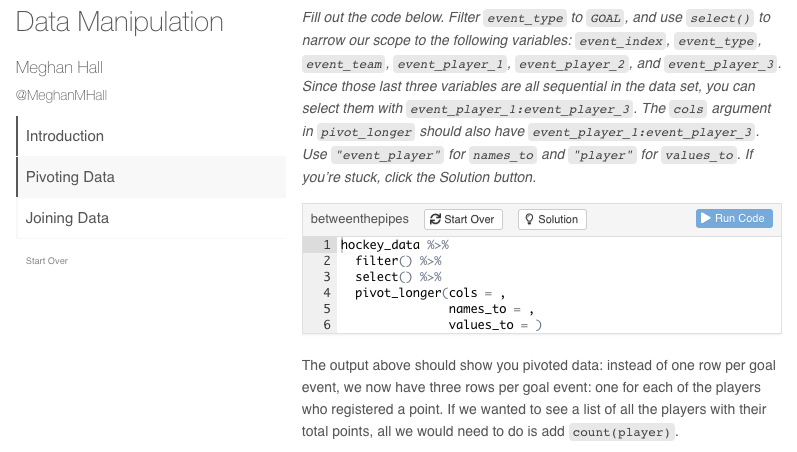

```{r setup, include=FALSE}
library(emo)
library(icon)
library(kableExtra)
options(knitr.kable.NA = '')
options(htmltools.dir.version = FALSE, htmltools.preserve.raw = FALSE)
knitr::opts_chunk$set(fig.retina = 3, 
                      warning = FALSE, 
                      message = FALSE,
                      fig.path = "figs/hanic/")

hanic_theme <- function () { 
  theme_linedraw(base_size=11, base_family="opensans") %+replace% 
    theme(
      panel.background  = element_blank(),
      plot.background = element_rect(fill="transparent", color=NA), 
      legend.background = element_rect(fill="transparent", color=NA),
      legend.key = element_rect(fill="transparent", color=NA),
      axis.ticks = element_blank(),
      panel.grid.major = element_line(color = "grey90", size = 0.3), 
      panel.grid.minor = element_blank(),
      plot.title = element_text(size = 13, hjust = 0, vjust = 0.5, face = "bold", margin = margin(b = 0.2, unit = "cm")),
      plot.subtitle = element_text(size = 9, hjust = 0, vjust = 0.5, margin = margin(b = 0.2, unit = "cm")),
      plot.caption = element_text(size = 7, hjust = 1, face = "italic", margin = margin(t = 0.1, unit = "cm"))
    )
}
```

```{r xaringan-themer, include=FALSE, warning=FALSE}
library(xaringanthemer)

style_mono_accent(
  header_font_google = google_font("Bebas Neue"),
  text_font_google   = google_font("Lato", "400", "400i"),
  code_font_google   = google_font("Roboto Mono"),
  link_color = "#8797AF",
  base_color = "#5C164E",
  extra_fonts = list(
    google_font("Lato")
  ),
  extra_css = list(
    ".title-slide h2" = list("font-family" = "Lato"),
    ".title-slide h3" = list("font-family" = "Lato")
  )
)
```

class: inverse, center, middle

# Using R for Your Big Data Cup Project

### A gentle intro and some tips & tricks
Meghan Hall <br> `r icon::fa("twitter")` [@MeghanMHall](https://www.twitter.com/MeghanMHall) <br> [meghan.rbind.io](https://meghan.rbind.io/) <br> [Hockey (Analytics) Night in Canada](https://www.hanic-analytics.com) <br> Feb. 18, 2021

---
background-image: url(figs/hanic/puck.png)
background-position: 98% 2%
background-size: 114px 104px
padding-right: 10px
layout: true
---

## Can I teach you R in 10 minutes?

...no &nbsp; `r emo::ji("disappointed")`

--

But we *can*...

- talk about what's easier to do in R
- go over some common functions you might use for this project
- discuss a roadmap for learning more

<br>

--

**Disclaimer** <br>
*The speaker herein pledges as follows: no declarative statements will be uttered about how R is objectively "the best" and no moral judgments will be made on which software, IDE, programming language, packages, dark mode, etc. the viewer chooses to use and/or not use.*

**tl;dr** <br>
I don't care what you use for your project! Use Excel! Use Python! Use SAS! Use an abacus!

--

<br>

But these are my 10 minutes, so we're going to talk about R.

---

## Step 0: How does one use R, exactly?

`r emo::ji("one")` &nbsp; the language itself: [https://cloud.r-project.org/](https://cloud.r-project.org/)

<br>

`r emo::ji("two")` &nbsp; the IDE (integrated development environment): [https://rstudio.com/products/rstudio/download/](https://rstudio.com/products/rstudio/download/)

---

## Step 1: Data!

```{r}
library(tidyverse)
library(janitor)

scouting <- read_csv("https://tinyurl.com/BDCscouting") %>% 
  clean_names()

nwhl <- read_csv("https://tinyurl.com/BDCnwhl") %>% 
  clean_names()

women <- read_csv("https://tinyurl.com/BDCwomens") %>% 
  clean_names()

```

---

## Step 1: Data!

```{r, eval = FALSE}
library(tidyverse) #<<
library(janitor) 

scouting <- read_csv("https://tinyurl.com/BDCscouting") %>%
  clean_names()

nwhl <- read_csv("https://tinyurl.com/BDCnwhl") %>%
  clean_names()

women <- read_csv("https://tinyurl.com/BDCwomens") %>%
  clean_names()

```

---

## Step 1: Data!

```{r, eval = FALSE}
library(tidyverse) 
library(janitor) 

scouting <- read_csv("https://tinyurl.com/BDCscouting") %>% #<<
  clean_names() 

nwhl <- read_csv("https://tinyurl.com/BDCnwhl") %>% #<<
  clean_names() 

women <- read_csv("https://tinyurl.com/BDCwomens") %>% #<<
  clean_names() 

```

---

## Step 1: Data!

```{r, eval = FALSE}
library(tidyverse) 
library(janitor) #<<

scouting <- read_csv("https://tinyurl.com/BDCscouting") %>%
  clean_names() #<<

nwhl <- read_csv("https://tinyurl.com/BDCnwhl") %>% 
  clean_names() #<<

women <- read_csv("https://tinyurl.com/BDCwomens") %>% 
  clean_names() #<<

```

---

## Step 2: Explore

```{r, eval = FALSE}

View(scouting) #<<

scouting %>% #<<
  glimpse() #<<

scouting %>% 
  count(event)

scouting %>% 
  count(event, detail_1)

```

---

## Step 2: Explore

```{r, eval = FALSE}

View(scouting)

scouting %>%
  glimpse() 

scouting %>% #<<
  count(event) #<<

scouting %>% 
  count(event, detail_1)

```

```{r, echo = FALSE}
scouting %>%
  count(event) %>% 
  head(8) %>% 
  kable("html") %>%
  kable_styling(font_size = 14, position = "left", full_width = F) %>%
  row_spec(0, bold = T, color = "white", background = "#5C164E")
```

---

## Step 2: Explore

```{r, eval = FALSE}

View(scouting)

scouting %>%
  glimpse() 

scouting %>%
  count(event) 

scouting %>% #<<
  count(event, detail_1) #<<

```

```{r, echo = FALSE}
scouting %>%
  count(event, detail_1) %>% 
  head(8) %>% 
  kable("html") %>%
  kable_styling(font_size = 14, position = "left", full_width = F) %>%
  row_spec(0, bold = T, color = "white", background = "#5C164E")
```

---

## Step 3: A Question

From the `scouting` data, among players who've taken at least 50 faceoffs, who has the best faceoff percentage?

--

(Is this the most *rigorous* Big Data Cup question? No, but I only have 10 minutes!)

--

```{r, echo = FALSE}
scouting %>%
  filter(event == "Faceoff Win") %>% 
  select(game_date, team, player, event, player_2) %>% 
  head(10) %>% 
  kable("html") %>%
  kable_styling(font_size = 14, position = "left", full_width = F) %>%
  row_spec(0, bold = T, color = "white", background = "#5C164E")
```

---

## Step 3: A Question

From the `scouting` data, among players who've taken at least 50 faceoffs, who has the best faceoff percentage?

(Is this the most *rigorous* Big Data Cup question? No, but I only have 10 minutes!)

```{r, echo = FALSE}
scouting %>%
  filter(event == "Faceoff Win") %>% 
  select(game_date, team, player, event, player_2) %>% 
  head(10) %>% 
  kable("html") %>%
  kable_styling(font_size = 14, position = "left", full_width = F) %>%
  row_spec(c(0, 3, 9), bold = T, color = "white", background = "#5C164E")
```

---

## Step 3: A Question

```{r, echo = FALSE}
faceoffs <- scouting %>% 
  filter(event == "Faceoff Win") %>% 
  select(player, player_2) %>% 
  rename(winner = player,
         loser = player_2) %>% 
  pivot_longer(winner:loser, 
               names_to = "status", 
               values_to = "player") %>% 
  mutate(win = ifelse(status == "winner", 1, 0)) %>% 
  group_by(player) %>% 
  summarize(faceoffs = n(),
            faceoff_wins = sum(win)) %>% 
  mutate(faceoff_perc = faceoff_wins / faceoffs) %>% 
  filter(faceoffs >= 50) %>% 
  arrange(desc(faceoff_perc))

faceoffs %>%
  kable("html") %>%
  kable_styling(font_size = 14, position = "left", full_width = F) %>%
  row_spec(0, bold = T, color = "white", background = "#5C164E")
```

---

## Step 3: A Question

```{r, eval = FALSE}

faceoffs <- scouting %>% 
  filter(event == "Faceoff Win") %>% 
  select(player, player_2) %>% 
  rename(winner = player,
         loser = player_2) %>% 
  pivot_longer(winner:loser, 
               names_to = "status", 
               values_to = "player") %>% 
  mutate(win = ifelse(status == "winner", 1, 0)) %>% 
  group_by(player) %>% 
  summarize(faceoffs = n(),
            faceoff_wins = sum(win)) %>% 
  mutate(faceoff_perc = faceoff_wins / faceoffs) %>% 
  filter(faceoffs >= 50) %>% 
  arrange(desc(faceoff_perc))

```

---

## Step 3: A Question

```{r, eval = FALSE}

faceoffs <- scouting %>% #<<
  filter(event == "Faceoff Win") %>% 
  select(player, player_2) %>% 
  rename(winner = player,
         loser = player_2) %>% 
  pivot_longer(winner:loser, 
               names_to = "status", 
               values_to = "player") %>% 
  mutate(win = ifelse(status == "winner", 1, 0)) %>% 
  group_by(player) %>% 
  summarize(faceoffs = n(),
            faceoff_wins = sum(win)) %>% 
  mutate(faceoff_perc = faceoff_wins / faceoffs) %>% 
  filter(faceoffs >= 50) %>% 
  arrange(desc(faceoff_perc))

```

---

## Step 3: A Question

```{r, eval = FALSE}

faceoffs <- scouting %>% 
  filter(event == "Faceoff Win") %>% #<<
  select(player, player_2) %>% #<<
  rename(winner = player,
         loser = player_2) %>% 
  pivot_longer(winner:loser, 
               names_to = "status", 
               values_to = "player") %>% 
  mutate(win = ifelse(status == "winner", 1, 0)) %>% 
  group_by(player) %>% 
  summarize(faceoffs = n(),
            faceoff_wins = sum(win)) %>% 
  mutate(faceoff_perc = faceoff_wins / faceoffs) %>% 
  filter(faceoffs >= 50) %>% 
  arrange(desc(faceoff_perc))

```

---

## Step 3: A Question

```{r, eval = FALSE}

faceoffs <- scouting %>% 
  filter(event == "Faceoff Win") %>% 
  select(player, player_2) %>% 
  rename(winner = player, #<<
         loser = player_2) %>% #<<
  pivot_longer(winner:loser, 
               names_to = "status", 
               values_to = "player") %>% 
  mutate(win = ifelse(status == "winner", 1, 0)) %>% 
  group_by(player) %>% 
  summarize(faceoffs = n(),
            faceoff_wins = sum(win)) %>% 
  mutate(faceoff_perc = faceoff_wins / faceoffs) %>% 
  filter(faceoffs >= 50) %>% 
  arrange(desc(faceoff_perc))

```

---

## Step 3: A Question

```{r, eval = FALSE}

faceoffs <- scouting %>% 
  filter(event == "Faceoff Win") %>% 
  select(player, player_2) %>% 
  rename(winner = player,
         loser = player_2) %>% 
  pivot_longer(winner:loser, #<<
               names_to = "status", #<<
               values_to = "player") %>% #<<
  mutate(win = ifelse(status == "winner", 1, 0)) %>% 
  group_by(player) %>% 
  summarize(faceoffs = n(),
            faceoff_wins = sum(win)) %>% 
  mutate(faceoff_perc = faceoff_wins / faceoffs) %>% 
  filter(faceoffs >= 50) %>% 
  arrange(desc(faceoff_perc))

```

---

## Step 3: A Question

```{r, echo = FALSE}
scouting %>%
  filter(event == "Faceoff Win") %>% 
  select(player, player_2) %>% 
  rename(winner = player,
         loser = player_2) %>% 
  pivot_longer(winner:loser,
               names_to = "status", 
               values_to = "player") %>%  
  head(10) %>% 
  kable("html") %>%
  kable_styling(font_size = 14, position = "left", full_width = F) %>%
  row_spec(0, bold = T, color = "white", background = "#5C164E")
```

---

## Step 3: A Question

```{r, eval = FALSE}

faceoffs <- scouting %>% 
  filter(event == "Faceoff Win") %>% 
  select(player, player_2) %>%
  rename(winner = player,
         loser = player_2) %>% 
  pivot_longer(winner:loser, 
               names_to = "status", 
               values_to = "player") %>% 
  mutate(win = ifelse(status == "winner", 1, 0)) %>% #<<
  group_by(player) %>% 
  summarize(faceoffs = n(),
            faceoff_wins = sum(win)) %>% 
  mutate(faceoff_perc = faceoff_wins / faceoffs) %>% 
  filter(faceoffs >= 50) %>% 
  arrange(desc(faceoff_perc))

```

---

## Step 3: A Question

```{r, eval = FALSE}

faceoffs <- scouting %>% 
  filter(event == "Faceoff Win") %>% 
  select(player, player_2) %>% 
  rename(winner = player,
         loser = player_2) %>% 
  pivot_longer(winner:loser, 
               names_to = "status", 
               values_to = "player") %>% 
  mutate(win = ifelse(status == "winner", 1, 0)) %>% 
  group_by(player) %>% #<<
  summarize(faceoffs = n(), #<<
            faceoff_wins = sum(win)) %>% #<<
  mutate(faceoff_perc = faceoff_wins / faceoffs) %>% 
  filter(faceoffs >= 50) %>% 
  arrange(desc(faceoff_perc))

```

---

## Step 3: A Question

```{r, eval = FALSE}

faceoffs <- scouting %>% 
  filter(event == "Faceoff Win") %>% 
  select(player, player_2) %>% 
  rename(winner = player,
         loser = player_2) %>% 
  pivot_longer(winner:loser, 
               names_to = "status", 
               values_to = "player") %>% 
  mutate(win = ifelse(status == "winner", 1, 0)) %>% 
  group_by(player) %>% 
  summarize(faceoffs = n(),
            faceoff_wins = sum(win)) %>% 
  mutate(faceoff_perc = faceoff_wins / faceoffs) %>% #<<
  filter(faceoffs >= 50) %>% #<<
  arrange(desc(faceoff_perc))

```

---

## Step 3: A Question

```{r, eval = FALSE}

faceoffs <- scouting %>% 
  filter(event == "Faceoff Win") %>% 
  select(player, player_2) %>% 
  rename(winner = player,
         loser = player_2) %>% 
  pivot_longer(winner:loser, 
               names_to = "status", 
               values_to = "player") %>% 
  mutate(win = ifelse(status == "winner", 1, 0)) %>% 
  group_by(player) %>% 
  summarize(faceoffs = n(),
            faceoff_wins = sum(win)) %>% 
  mutate(faceoff_perc = faceoff_wins / faceoffs) %>% 
  filter(faceoffs >= 50) %>% 
  arrange(desc(faceoff_perc)) #<<

```

---

## Step 3: A Question

```{r, echo = FALSE}
faceoffs %>%
  kable("html") %>%
  kable_styling(font_size = 14, position = "left", full_width = F) %>%
  row_spec(0, bold = T, color = "white", background = "#5C164E")
```
---

## Step 4: A graph!

```{r, echo = FALSE, fig.align = "center"}
faceoffs_team <- scouting %>% 
  filter(event == "Faceoff Win") %>% 
  select(home_team, away_team, team, player, player_2) %>% 
  rename(player_winner = player,
         player_loser = player_2,
         team_winner = team) %>% 
  mutate(team_loser = ifelse(team_winner == home_team, away_team, home_team)) %>% 
  select(-c(home_team, away_team)) %>% 
  pivot_longer(everything(),
               names_to = c(".value", "status"),
               names_pattern = "(.+)_(.+)") %>% 
  mutate(win = ifelse(status == "winner", 1, 0)) %>% 
  group_by(player, team) %>% 
  summarize(faceoffs = n(),
            faceoff_wins = sum(win)) %>% 
  mutate(faceoff_perc = faceoff_wins / faceoffs) %>% 
  filter(faceoffs >= 50) %>% 
  arrange(desc(faceoff_perc))

faceoffs_team %>% 
  ggplot(aes(x = reorder(player, faceoff_perc), y = faceoff_perc, fill = team)) +
  geom_bar(stat = "identity") +
  coord_flip() +
  scale_fill_manual(values = c("#F2A900", "#FF6720", "#862633", "#00205B", "#010101", "#C8C9C7")) +
  labs(title = "Faceoff Percentages",
       subtitle = "Among players with 50+ faceoffs, from Big Data Cup scouting data set") +
  ylab("Faceoff Win Percentage") +
  geom_text(aes(label = scales::percent(faceoff_perc, accuracy = 0.1)), family = "opensans", hjust = -0.15) +
  scale_y_continuous(labels = scales::percent_format(accuracy = 1), limits = c(0, 0.72)) +
  hanic_theme() +
  theme(legend.title = element_blank(),
        legend.position = "bottom",
        panel.grid.major.y = element_blank(),
        axis.title.y = element_blank())
```

---

## Step 4: A graph!

```{r, eval = FALSE}

faceoffs_team %>% 
  ggplot(aes(x = reorder(player, faceoff_perc), 
             y = faceoff_perc, fill = team)) +
  geom_bar(stat = "identity") +
  coord_flip() +
  scale_fill_manual(values = c("#F2A900", "#FF6720", "#862633", 
                               "#00205B", "#010101", "#C8C9C7")) +
  labs(title = "Faceoff Percentages",
       subtitle = "Among players with 50+ faceoffs, from Big Data 
       Cup scouting data set") +
  ylab("Faceoff Win Percentage") +
  geom_text(aes(label = scales::percent(faceoff_perc, 
                                        accuracy = 0.1)), 
            family = "Seravek", hjust = -0.15) +
  scale_y_continuous(labels = scales::percent_format(accuracy = 1), 
                     limits = c(0, 0.72)) +
  hanic_theme() +
  theme(legend.title = element_blank(),
        legend.position = "bottom",
        panel.grid.major.y = element_blank(),
        axis.title.y = element_blank())
```

---

## Step 4: A graph!

```{r, eval = FALSE}

faceoffs_team %>% 
  ggplot(aes(x = reorder(player, faceoff_perc), #<<
             y = faceoff_perc, fill = team)) + #<<
  geom_bar(stat = "identity") + #<<
  coord_flip() + #<<
  scale_fill_manual(values = c("#F2A900", "#FF6720", "#862633", 
                               "#00205B", "#010101", "#C8C9C7")) +
  labs(title = "Faceoff Percentages",
       subtitle = "Among players with 50+ faceoffs, from Big Data 
       Cup scouting data set") +
  ylab("Faceoff Win Percentage") +
  geom_text(aes(label = scales::percent(faceoff_perc, 
                                        accuracy = 0.1)), 
            family = "Seravek", hjust = -0.15) +
  scale_y_continuous(labels = scales::percent_format(accuracy = 1), 
                     limits = c(0, 0.72)) +
  hanic_theme() +
  theme(legend.title = element_blank(),
        legend.position = "bottom",
        panel.grid.major.y = element_blank(),
        axis.title.y = element_blank())
```

---

## Step 4: A graph!

```{r, eval = FALSE}

faceoffs_team %>% 
  ggplot(aes(x = reorder(player, faceoff_perc), 
             y = faceoff_perc, fill = team)) + 
  geom_bar(stat = "identity") + 
  coord_flip() + 
  scale_fill_manual(values = c("#F2A900", "#FF6720", "#862633", #<<
                               "#00205B", "#010101", "#C8C9C7")) + #<<
  labs(title = "Faceoff Percentages", #<<
       subtitle = "Among players with 50+ faceoffs, from Big Data #<<
       Cup scouting data set") + #<<
  ylab("Faceoff Win Percentage") + #<<
  geom_text(aes(label = scales::percent(faceoff_perc, #<<
                                        accuracy = 0.1)), #<<
            family = "Seravek", hjust = -0.15) + #<<
  scale_y_continuous(labels = scales::percent_format(accuracy = 1), #<<
                     limits = c(0, 0.72)) + #<<
  hanic_theme() + #<<
  theme(legend.title = element_blank(), #<<
        legend.position = "bottom", #<<
        panel.grid.major.y = element_blank(), #<<
        axis.title.y = element_blank()) #<<
```

---

## Learn More

If you want to stick with the hockey theme:

- [my workshop from CMSAC last year](https://meghan.rbind.io/talk/cmsac/)
- [interactive tutorials in RStudio](https://github.com/meghall06/betweenthepipes)

```{r eval=FALSE}
install.packages("devtools")
devtools::install_github("meghall06/betweenthepipes")

# look in the Tutorial pane in the upper-right of RStudio
# or...run:

betweenthepipes::intro()
betweenthepipes::data_manip()

```

---

## Learn More

If you want to stick with the hockey theme:

- [my workshop from CMSAC last year](https://meghan.rbind.io/talk/cmsac/)
- [interactive tutorials in RStudio](https://github.com/meghall06/betweenthepipes)

.center[]

---

## Learn More

If you want to stick with the hockey theme:

- [my workshop from CMSAC last year](https://meghan.rbind.io/talk/cmsac/)
- [interactive tutorials in RStudio](https://github.com/meghall06/betweenthepipes)

```{r eval=FALSE}
install.packages("devtools")
devtools::install_github("meghall06/betweenthepipes")

# look in the Tutorial pane in the upper-right of RStudio
# or...run:

betweenthepipes::intro()
betweenthepipes::data_manip()

```

Elsewhere:

- [R for Data Science](https://r4ds.had.co.nz/) &nbsp; `r emo::ji("star")`
- [R for Excel Users](https://rstudio-conf-2020.github.io/r-for-excel/)
- [STAT 545](https://stat545.com/)

---

class: inverse, center, middle
layout: false

# Thanks!

`r icon::fa("twitter")` [@MeghanMHall](https://www.twitter.com/MeghanMHall) <br> [meghan.rbind.io](https://meghan.rbind.io/) <br>
Slides created via the R package [xaringan](https://github.com/yihui/xaringan).
