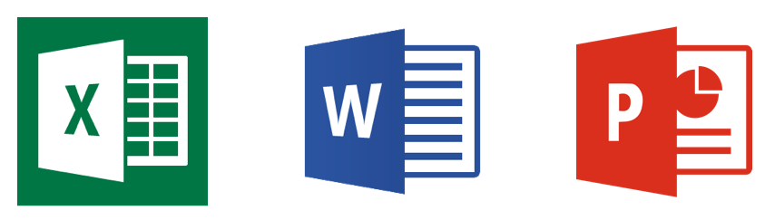
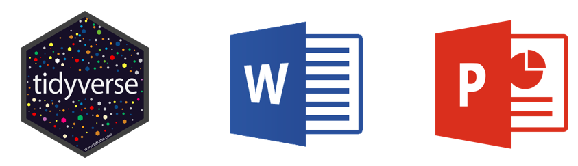
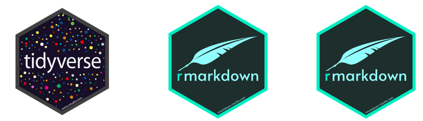
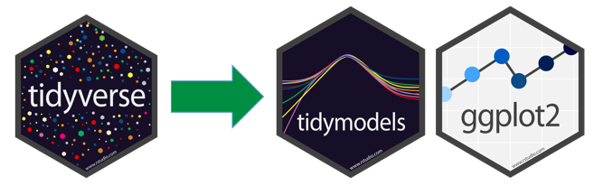
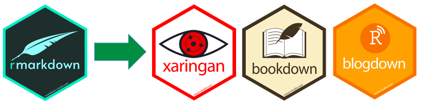

```{r setup, include=FALSE}
library(emo)
library(icons)
library(kableExtra)
library(tidyverse)
options(knitr.kable.NA = '')
options(htmltools.dir.version = FALSE, htmltools.preserve.raw = FALSE)
knitr::opts_chunk$set(fig.retina = 3, 
                      warning = FALSE, 
                      message = FALSE,
                      fig.path = "figs")


```

```{r xaringan-themer, include=FALSE, warning=FALSE}
library(xaringanthemer)

style_mono_accent(
  header_font_google = google_font("Montserrat"),
  text_font_google   = google_font("Nunito Sans", "400", "400i"),
  code_font_google   = google_font("Roboto Mono"),
  link_color = "#098641",
  inverse_link_color = "#ffffff",
  base_color = "#098641",
  extra_fonts = list(
    google_font("Lato")
  ),
  extra_css = list(
    ".title-slide h2" = list("font-family" = "Montserrat"),
    ".title-slide h3" = list("font-family" = "Montserrat")
  )
)
```


class: inverse, left, middle

# Extending R Markdown
## Meghan Hall

RStudio: R in Sports Analytics<br> June 15, 2021 <br> <br> `r icons::fontawesome$brands$twitter` [@MeghanMHall](https://www.twitter.com/MeghanMHall) <br> `r icons::fontawesome$brands$github`  [meghall6](https://github.com/meghall06) <br> `r icons::fontawesome$solid$laptop`  [meghan.rbind.io](https://meghan.rbind.io/)

---
layout: true
<div class="my-footer"><span></span></div>

---

.left[# R (+ Sports)]

<br>

.pull-left[
## `r emo::ji("graduation_cap")`&nbsp; 
data manager in higher ed

## `r emo::ji("bar_chart")`&nbsp; 
teaching data viz course @ CMU

]

--

.pull-right[
## `r emo::ji("baseball")`&nbsp; 
data scientist at Zelus Analytics

## `r emo::ji("ice_hockey")`&nbsp; 
hockey analysis + tutorials
]

---

# What is R Markdown?

<br>
<br>

.large[A powerful and underrated tool...]

--

<br>

.large[...for a powerful and underrated component of data science: **communication**]

--

<br>

.medium[to yourself and to your teammates]

--

.medium[to those above you on the org ladder]

---

class: center

#### `r emo::ji("confused_face")`&nbsp; 
```{r out.width = '50%', echo = FALSE}
# local

```

--

#### `r emo::ji("slightly_smiling_face")`&nbsp; 
```{r out.width = '50%', echo = FALSE}
# local

```

--

#### `r emo::ji("grinning_face")`&nbsp; 
```{r out.width = '50%', echo = FALSE}
# local

```

---

# Communicating with R Markdown


.large[To yourself and your teammates]<br>
.medium["classic" .Rmd documents]

--

<br>

.large[To those above you]<br>
.medium[PDFs and slide decks and dashboards]<br>
.medium[aka `knitr` and `xaringan` and `flexdashboard`]

--

<br>

.large[To the public]<br>
.medium[websites and books]<br>
.medium[aka `distill` and `blogdown` and `bookdown`]

---

# That's so much to learn...

--

<br>

```{r out.width = '60%', echo = FALSE, fig.align = "center"}
# local

```

<br>

--

```{r out.width = '70%', echo = FALSE, fig.align = "center"}
# local

```

---

# Where to start

<br>
<br>

.large[[RStudio tutorial](https://rmarkdown.rstudio.com/lesson-1.html)]

<br>

.large[[R Markdown: The Definitive Guide](https://bookdown.org/yihui/rmarkdown/)]

<br>

.large[[anything created by Alison Hill](https://alison.rbind.io/project/)]

---

class: center, middle, inverse


# is (about to be) hiring!

[zelusanalytics.com](https://zelusanalytics.com/)
`r icons::fontawesome$brands$twitter` [@ZelusAnalytics](https://www.twitter.com/ZelusAnalytics)

---

class: center, middle, inverse

# Thank you!

Slides created via the R package [xaringan](https://github.com/yihui/xaringan).
<br>
`r icons::fontawesome$brands$twitter` [@MeghanMHall](https://www.twitter.com/MeghanMHall)
