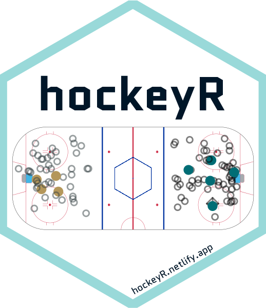
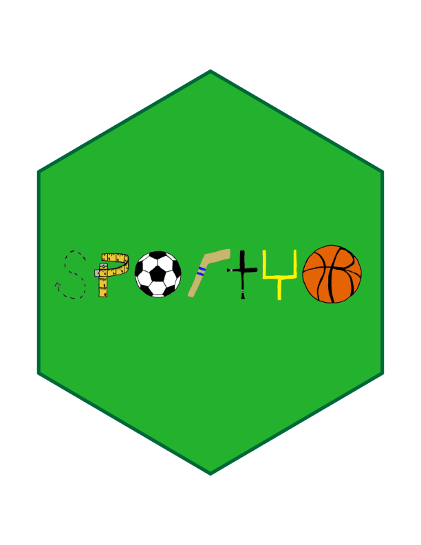

```{r setup, include=FALSE}
library(emo)
library(icons)
library(kableExtra)
library(tidyverse)
library(janitor)
library(hockeyR)
library(sportyR)
library(gt)
library(gtExtras)
library(ggtext)
library(showtext)

font_add_google(name = "Ubuntu",   # Name of the font on the Google Fonts site
                family = "ubuntu")
showtext_auto()

ucsas_theme <- function () { 
  theme_linedraw(base_size=11, base_family="ubuntu") %+replace% 
    theme(
      panel.background  = element_blank(),
      plot.background = element_rect(fill = "transparent", color = NA), 
      legend.background = element_rect(fill = "transparent", color = NA),
      legend.key = element_rect(fill = "transparent", color = NA),
      axis.ticks = element_blank(),
      panel.grid.major = element_line(color = "grey90", size = 0.3), 
      panel.grid.minor = element_blank(),
      plot.title = element_text(size = 18, hjust = 0, vjust = 0.5, face = "bold", margin = margin(b = 0.2, unit = "cm")),
      plot.subtitle = element_text(size = 12, hjust = 0, vjust = 0.5, margin = margin(b = 0.2, unit = "cm")),
      plot.caption = element_text(size = 7, hjust = 1, face = "italic", margin = margin(t = 0.1, unit = "cm")),
      axis.text.x = element_text(size = 13),
      axis.text.y = element_text(size = 13)
    )
}

options(knitr.kable.NA = '')
options(htmltools.dir.version = FALSE, htmltools.preserve.raw = FALSE)
knitr::opts_chunk$set(fig.retina = 3, 
                      warning = FALSE, 
                      message = FALSE,
                      fig.path = "figs/")

pbp <- read_csv("https://raw.githubusercontent.com/meghall06/personal-website/master/static/slides/UCSAS/pbp.csv")

roster <- read_csv("https://raw.githubusercontent.com/meghall06/personal-website/master/static/slides/UCSAS/roster.csv")
```

```{r xaringan-themer, include=FALSE, warning=FALSE}
library(xaringanthemer)

style_mono_accent(
  header_font_google = google_font("Work Sans"),
  text_font_google   = google_font("Ubuntu", "400", "400i"),
  code_font_google   = google_font("Roboto Mono"),
  link_color = "#661414",
  inverse_link_color = "#ffffff",
  base_color = "#661414",
  extra_fonts = list(
    google_font("Lato")
  ),
  extra_css = list(
    ".title-slide h2" = list("font-family" = "Anton"),
    ".title-slide h3" = list("font-family" = "Anton")
  )
)
```


class: inverse, left, middle

# An Introduction to Hockey Analytics with R
## Meghan Hall

UConn Sports Analytics Symposium<br> October 9, 2021 <br> <br> `r icons::fontawesome$brands$twitter` [@MeghanMHall](https://www.twitter.com/MeghanMHall) <br> `r icons::fontawesome$brands$github`  [meghall6](https://github.com/meghall06) <br> `r icons::fontawesome$solid$laptop`  [meghan.rbind.io](https://meghan.rbind.io/)

---
layout: true
<div class="my-footer"><span>tinyurl.com/ucsas21</span></div>
---

# About ~~me~~ you

<br>
<br>

.large[You know a bit about R...]

<br>

.large[...and a bit about hockey]

---

layout: true
<div class="my-footer"><span>tinyurl.com/ucsas21</span></div>

---

.left[# About me]

<br>

.pull-left[
## `r emo::ji("moneybag")` `r emo::ji("party_popper")`&nbsp;
data manager in higher ed

data scientist at Zelus Analytics

]

--

.pull-right[
## `r emo::ji("party_popper")` `r emo::ji("moneybag")`&nbsp;
hockey analysis

courses + tutorials + workshops
]

---

# Today's agenda

<br>

.large[Explore how R makes hockey analysis easier]<br>
.medium[Data manipulation, via the `r emo::ji("star")``tidyverse``r emo::ji("star")` and data visualization]

<br>

.large[Go through a basic hockey analysis question]

--

<br>

.large[*A Day in the Life of an NHL Power Play*]

---

# Data sources

<br>

```{r out.width = '70%', echo = FALSE, fig.align = "center"}
# local
knitr::include_graphics("figs/data.gif")
```

---

# Data sources

.large[Aggregate data freely available for most leagues]<br>
.medium[league websites, eliteprospects.com]<br>
.medium[some event data for AHL & CHL]<br>
.medium[no TOI `r emo::ji("expressionless")`]

<br>

.large[[Big Data Cup](https://github.com/bigdatacup/Big-Data-Cup-2021)]

<br>

.large[Specialty sources, usually for a fee]<br>
.medium[[Their Hockey Counts](https://theirhockeycounts.com/index.html#about)]<br>
.medium[[CHL microstats](https://www.patreon.com/user/overview?u=13951676)]<br>
.medium[[NHL microstats](https://www.patreon.com/CSznajder)]<br>

---

# hockeyR

```{r out.width = '20%', echo = FALSE, fig.align = "center"}
# local

```

.large[From Dan Morse: [hockeyr.netlify.app/](https://hockeyr.netlify.app/)]

<br>

.large[Various functions to scrape NHL play-by-play data]

<br>

.large[Other helper functions to assist with analysis]

---

# Today's packages

```{r, eval = FALSE}
library(tidyverse)
library(janitor)
library(hockeyR)
library(sportyR)
library(gt)
library(gtExtras)
library(ggtext)
```

---

# hockeyR

sample functions from `hockeyR`
```{r, eval = FALSE}
scrape_game(2020020322)

scrape_day(day = "2021-02-27")

scrape_season(season = 2020, type = "REG")
```

--
<br>
today's data
```{r, eval = FALSE}
pbp <- scrape_day(day = "2021-02-27")
```

---

# What is play-by-play data?

.medium[`pbp` from `hockeyR` has 105 variables]<br>
One row per event, with location (`x` and `y`), players on ice, etc.

--

```{r, echo = FALSE}
pbp %>% 
  count(event_type, sort = TRUE) %>% 
  kable("html") %>%
  kable_styling(font_size = 16, position = "center", full_width = F) %>%
  row_spec(0, bold = T, color = "white", background = "#661414")
```

---

# What is play-by-play data?

.medium[`pbp` from `hockeyR` has 105 variables]<br>
One row per event, with location (`x` and `y`), players on ice, etc.

<br>

.large[Tracking data??]

---

# The data we want

```{r}
powerplay <- pbp %>% 
  mutate(length = lead(period_seconds) - period_seconds,
         PP_team = case_when((event_team_type == "home" & 
                                strength_state == "5v4") | 
                               (event_team_type == "away" & 
                                  strength_state == "4v5") 
                             ~ home_abbreviation,
                             TRUE ~ away_abbreviation)) %>% 
  filter(strength_state %in% c("5v4","4v5") & 
           (length > 0 | event_type %in% c("GOAL","SHOT"))) %>% 
  select(event_type, event_team_abbr, event_team_type, 
         home_abbreviation, away_abbreviation, PP_team,
         length, strength_state, x:y_fixed, home_on_1:away_on_7, 
         event_idx, game_id, period) %>% 
  remove_empty("cols")
```

---

# The data we want

```{r, echo = FALSE}
powerplay %>% 
  select(event_type, PP_team, length, home_on_1:home_on_2, game_id, event_idx) %>% 
  head(10) %>% 
  kable("html") %>%
  kable_styling(font_size = 16, position = "center", full_width = F) %>%
  row_spec(0, bold = T, color = "white", background = "#661414")
```

---

# The question we have

.large[*A Day in the Life of an NHL Power Play*]

<br>

--

.large[Position breakdown of a power play: usually 4F/1D, sometimes 3F/2D]

<br>

.large[How does that vary among these teams for this one day of games?]

---

# The data we have

what is missing and what structure do we need?

```{r, echo = FALSE}
powerplay %>% 
  select(event_type, PP_team, length, home_on_1:home_on_2, game_id, event_idx) %>% 
  head(10) %>% 
  kable("html") %>%
  kable_styling(font_size = 16, position = "center", full_width = F) %>%
  row_spec(0, bold = T, color = "white", background = "#661414")
```

---

# Changing the level of observation

```{r}
player <- powerplay %>% 
  mutate(PP_1 = ifelse(PP_team == home_abbreviation, home_on_1, 
                       away_on_1),
         PP_2 = ifelse(PP_team == home_abbreviation, home_on_2, 
                       away_on_2),
         PP_3 = ifelse(PP_team == home_abbreviation, home_on_3, 
                       away_on_3),
         PP_4 = ifelse(PP_team == home_abbreviation, home_on_4, 
                       away_on_4),
         PP_5 = ifelse(PP_team == home_abbreviation, home_on_5, 
                       away_on_5)) %>% 
  select(game_id, event_idx, contains("PP"), length) %>% 
  pivot_longer(PP_1:PP_5, values_to = "player")
```

---

# Changing the level of observation

```{r, echo = FALSE}
player %>% 
  head(10) %>% 
  kable("html") %>%
  kable_styling(font_size = 16, position = "center", full_width = F) %>%
  row_spec(0, bold = T, color = "white", background = "#661414")
```

---

# Adding position data

```{r, eval = FALSE}
roster <- get_rosters(team = "all", season = 2021)
```
--
```{r}
position <- roster %>% 
  select(player, position) %>% 
  unique()
```
--
```{r, echo = FALSE}
position %>% 
  head(9) %>% 
  kable("html") %>%
  kable_styling(font_size = 16, position = "center", full_width = F) %>%
  row_spec(0, bold = T, color = "white", background = "#661414")
```

---

# Adding position data

```{r}
position %>% 
  get_dupes(player)
```

--

```{r}
position <- position %>% 
  filter(!(player == "Sebastian Aho" & position == "D"))

position <- position %>% 
  mutate(player = str_replace_all(player, " ", "."),
         player = str_replace_all(player, "-", "."),
         player = str_replace_all(player, "'", "."))
```

--

```{r, echo = FALSE}
position %>% 
  head(1) %>% 
  kable("html") %>%
  kable_styling(font_size = 16, position = "center", full_width = F) %>%
  row_spec(0, bold = T, color = "white", background = "#661414")
```

---

# Adding position data

joining data by name can be `r emo::ji("wavy mouth")`
```{r, eval = FALSE}
player %>% 
  left_join(position, by = "player") %>% 
  filter(is.na(position)) %>% 
  select(player) %>% 
  unique()
```

--

```{r, echo = FALSE}
player %>% 
  left_join(position, by = "player") %>% 
  filter(is.na(position)) %>% 
  select(player) %>% 
  unique() %>% 
  kable("html") %>%
  kable_styling(font_size = 16, position = "center", full_width = F) %>%
  row_spec(0, bold = T, color = "white", background = "#661414")
```

---

# Adding position data

```{r}
position <- position %>% 
  mutate(player = case_when(player == "Joshua.Norris" ~ "Josh.Norris",
                      player == "Mitch.Marner" ~ "Mitchell.Marner",
                      player == "Callan.Foote" ~ "Cal.Foote",
                      player == "Nicholas.Caamano" ~ "Nick.Caamano",
                      player == "Alexander.Wennberg" ~ "Alex.Wennberg",
                      player == "Dominik.Kubalík" ~ "Dominik.Kubalik",
                      player == "Mathew.Dumba" ~ "Matt.Dumba",
                      TRUE ~ player))
```

--

```{r}
player <- player %>% 
  left_join(position, by = "player") %>% 
  mutate(forward = ifelse(str_detect(position, "D"), 0, 1))
```

---

# Adding position data

```{r, echo = FALSE}
player %>% 
  head(10) %>% 
  kable("html") %>%
  kable_styling(font_size = 16, position = "center", full_width = F) %>%
  row_spec(0, bold = T, color = "white", background = "#661414")
```

---

# Changing the level of detail

```{r}
fwd <- player %>% 
  group_by(game_id, event_idx, PP_team) %>%
  summarize(fwds = sum(forward),
            length = mean(length)) %>% 
  group_by(PP_team, fwds) %>% 
  summarize(time = sum(length)) %>% 
  add_tally(time, n = "total_time") %>% 
  mutate(perc = time / total_time) %>% 
  filter(fwds == 4)
```

---

# Changing the level of detail

```{r, eval = FALSE}
fwd <- player %>% 
  `group_by(game_id, event_idx, PP_team)` %>% 
  `summarize(fwds = sum(forward),`
            `length = mean(length))` %>% 
  group_by(PP_team, fwds) %>% 
  summarize(time = sum(length)) %>% 
  add_tally(time, n = "total_time") %>% 
  mutate(perc = time / total_time) %>% 
  filter(fwds == 4)
```

```{r, echo = FALSE}
player %>% 
  group_by(game_id, event_idx, PP_team) %>%
  summarize(fwds = sum(forward),
            length = mean(length)) %>% 
  head(5) %>% 
  kable("html") %>%
  kable_styling(font_size = 16, position = "center", full_width = F) %>%
  row_spec(0, bold = T, color = "white", background = "#661414")
```

---

# Changing the level of detail

```{r, eval = FALSE}
fwd <- player %>% 
  group_by(game_id, event_idx, PP_team) %>% 
  summarize(fwds = sum(forward),
            length = mean(length)) %>% 
  `group_by(PP_team, fwds)` %>% 
  `summarize(time = sum(length))` %>% 
  add_tally(time, n = "total_time") %>% 
  mutate(perc = time / total_time) %>% 
  filter(fwds == 4)
```

```{r, echo = FALSE}
player %>% 
  group_by(game_id, event_idx, PP_team) %>%
  summarize(fwds = sum(forward),
            length = mean(length))  %>% 
  group_by(PP_team, fwds) %>% 
  summarize(time = sum(length)) %>% 
  head(5) %>% 
  kable("html") %>%
  kable_styling(font_size = 16, position = "center", full_width = F) %>%
  row_spec(0, bold = T, color = "white", background = "#661414")
```

---

# Changing the level of detail

```{r, eval = FALSE}
fwd <- player %>% 
  group_by(game_id, event_idx, PP_team) %>% 
  summarize(fwds = sum(forward),
            length = mean(length)) %>% 
  group_by(PP_team, fwds) %>% 
  summarize(time = sum(length)) %>% 
  `add_tally(time, n = "total_time")` %>% 
  `mutate(perc = time / total_time)` %>% 
  filter(fwds == 4)
```

```{r, echo = FALSE}
player %>% 
  group_by(game_id, event_idx, PP_team) %>%
  summarize(fwds = sum(forward),
            length = mean(length))  %>% 
  group_by(PP_team, fwds) %>% 
  summarize(time = sum(length)) %>% 
  add_tally(time, n = "total_time") %>% 
  mutate(perc = time / total_time) %>% 
  head(5) %>% 
  kable("html") %>%
  kable_styling(font_size = 16, position = "center", full_width = F) %>%
  row_spec(0, bold = T, color = "white", background = "#661414")
```

---

# Changing the level of detail

```{r, eval = FALSE}
fwd <- player %>% 
  group_by(game_id, event_idx, PP_team) %>%
  summarize(fwds = sum(forward),
            length = mean(length)) %>% 
  group_by(PP_team, fwds) %>% 
  summarize(time = sum(length)) %>% 
  add_tally(time, n = "total_time") %>% 
  mutate(perc = time / total_time) %>% 
  filter(fwds == 4)
```

```{r, echo = FALSE}
fwd %>% 
  head(6) %>% 
  kable("html") %>%
  kable_styling(font_size = 16, position = "center", full_width = F) %>%
  row_spec(0, bold = T, color = "white", background = "#661414")
```

---

# Using `team_logos_colors`

```{r}
logos <- team_logos_colors
```

--

```{r, echo = FALSE}
logos %>% 
  select(team_abbr, team_color1, team_color2, team_logo_espn) %>% 
  head(5) %>% 
  kable("html") %>%
  kable_styling(font_size = 16, position = "center", full_width = F) %>%
  row_spec(0, bold = T, color = "white", background = "#661414")
```

--

```{r}
fwd <- fwd %>% 
  left_join(select(logos, team_abbr, team_logo_espn, team_color1), 
            by = c("PP_team" = "team_abbr"))
```

---

# Tables with `gt`

```{r, echo = FALSE}
fwd %>% 
  ungroup() %>% 
  select(team_logo_espn, perc) %>% 
  arrange(desc(perc)) %>% 
  gt() %>% 
  tab_header(title = "Percentage of 5v4 Power Play Time With Four Forwards",
             subtitle = "Draw no conclusions, this is one night of games!") %>%
  gt_img_rows(columns = team_logo_espn, height = 25) %>% 
  fmt_percent(perc, decimals = 0) %>% 
  gt_color_rows(perc,
                palette = "ggsci::blue_grey_material") %>% 
  tab_style(style = list(cell_fill(color = "white")),
    locations = cells_body(columns = c(team_logo_espn))) %>% 
  tab_options(table.font.size = 12,
              heading.title.font.size = 14,
              table.width = px(250),
              container.height = px(450),
              column_labels.hidden = TRUE,
              data_row.padding = px(1),
              table_body.hlines.width = 0,
              table.border.top.color = 'black',
              table.border.top.width = 2,
              heading.border.bottom.color = 'black',
              heading.border.bottom.width = 2,
              table_body.border.bottom.color = 'black',
              table_body.border.bottom.width = 2)
```

---

.h-1[# Tables with `gt`]

.tiny[
```{r, eval = FALSE}
fwd %>% 
  ungroup() %>% 
  select(team_logo_espn, perc) %>% 
  arrange(desc(perc)) %>% 
  gt() %>% 
  tab_header(title = "Percentage of 5v4 Power Play Time With Four Forwards",
             subtitle = "Draw no conclusions, this is one night of games!") %>%
  `gt_img_rows(columns = team_logo_espn, height = 25)` %>% 
  `fmt_percent(perc, decimals = 0)` %>% 
  `gt_color_rows(perc,`
                `palette = "ggsci::blue_grey_material")` %>% 
  tab_style(style = list(cell_fill(color = "white")),
    locations = cells_body(columns = c(team_logo_espn))) %>% 
  tab_options(table.font.size = 12,
              heading.title.font.size = 14,
              table.width = px(250),
              column_labels.hidden = TRUE,
              data_row.padding = px(1),
              table_body.hlines.width = 0,
              table.border.top.color = 'black',
              table.border.top.width = 2,
              heading.border.bottom.color = 'black',
              heading.border.bottom.width = 2,
              table_body.border.bottom.color = 'black',
              table_body.border.bottom.width = 2)
```
]

---

# Plots with `ggplot2`

```{r bar-chart, echo = FALSE, fig.align = "center", fig.height = 6.5}
fwd %>% 
  ggplot(aes(x = perc, y = reorder(PP_team, perc))) +
  geom_bar(stat = "identity", fill = fwd$team_color1) +
  scale_x_continuous(label = scales::percent,
                     expand = expansion(mult = c(0, 0.05))) +
  labs(x = NULL, y = NULL,
       title = "Percentage of 5v4 power play time with four forwards",
       subtitle = "Games on Feb. 27, 2021") +
  theme_linedraw() +
  ucsas_theme() +
  theme(plot.title.position = "plot",
        panel.grid.major.y = element_blank())
```

---

# Plots with `ggplot2`

```{r, eval = FALSE}
fwd %>% 
  ggplot(aes(x = perc, y = reorder(PP_team, perc))) +
  geom_bar(stat = "identity", `fill = fwd$team_color1`) +
  scale_x_continuous(label = scales::percent,
                     expand = expansion(mult = c(0, 0.05))) +
  labs(x = NULL, y = NULL,
       title = "Percentage of 5v4 power play time with four forwards",
       subtitle = "Games on Feb. 27, 2021") +
  theme_linedraw() +
  ucsas_theme() +
  theme(plot.title.position = "plot")
```

---

# Shot plots with `sportyR`

```{r out.width = '20%', echo = FALSE, fig.align = "center"}
# local

```

.large[From Ross Drucker  [`r icons::fontawesome$brands$github`](https://github.com/rossdrucker/sportyR#readme)]

<br>

.large[Functions to aid in plotting various sport courts/rinks/fields]

---

# Shot plots with `sportyR`

`x_fixed` and `y_fixed` correct coordinates so home team shoots to the right, away team to the left<br>

```{r rink, fig.align = "center", fig.height = 4}
PP_shots <- powerplay %>% 
  filter(event_type %in% c("SHOT","GOAL") & 
           event_team_abbr == PP_team)

geom_hockey("nhl") +
  geom_point(data = PP_shots, aes(x = x_fixed, y = y_fixed))
```

---

# Shot plots with `sportyR`

```{r, echo = FALSE}
PP_shots <- powerplay %>% 
  filter(event_type %in% c("SHOT","GOAL") & event_team_abbr == PP_team) %>% 
  mutate(x_rotate = ifelse(x > 0, x * -1, x),
         y_rotate = ifelse(x > 0, y * -1, y)) %>% 
  arrange(desc(event_type))
```

```{r shot-plot, echo = FALSE, fig.align = "center"}
geom_hockey("nhl", full_surf = FALSE) +
  geom_point(data = PP_shots, aes(x_rotate, y_rotate),
    size = 6,
    color = ifelse(PP_shots$event_type == "GOAL", "#661414", "#A9A9A9"),
    alpha = ifelse(PP_shots$event_type == "GOAL", 1, 0.5)) +
  labs(title = "Shots and <span style = 'color:#661414;'>**goals**</span> on the 5v4 power play",
    subtitle = "On the night of February 27, 2021",
    caption = "Data from hockeyR & plot made with sportyR by @MeghanMHall") +
  theme(plot.title = element_markdown(hjust = 0.5, vjust = 0.5, size = 16),
        plot.subtitle = element_text(hjust = 0.5, face = "italic"),
        plot.caption = element_text(hjust = 0.5))
```

---

# Shot plots with `sportyR`

```{r, eval = FALSE}
PP_shots <- powerplay %>% 
  filter(event_type %in% c("SHOT","GOAL") & 
           event_team_abbr == PP_team) %>% 
  mutate(x_rotate = ifelse(x > 0, x * -1, x),
         y_rotate = ifelse(x > 0, y * -1, y)) %>% 
  arrange(desc(event_type))
```

--

```{r, eval = FALSE}
geom_hockey("nhl", `full_surf = FALSE`) +
  geom_point(data = PP_shots, `aes(x = x_rotate, y = y_rotate)`,
             size = 6,
             color = ifelse(PP_shots$event_type == "GOAL", "#661414", "#A9A9A9"),
             alpha = ifelse(PP_shots$event_type == "GOAL", 1, 0.5)) +
  labs(title = "Shots and <span style = 'color:#661414;'>**goals**</span> on the 5v4 power play",
    subtitle = "On the night of February 27, 2021",
    caption = "Data from hockeyR & plot made with sportyR by @MeghanMHall") +
  theme(plot.title = element_markdown(hjust = 0.5, vjust = 0.5, size = 16),
        plot.subtitle = element_text(hjust = 0.5, face = "italic"),
        plot.caption = element_text(hjust = 0.5))
```

---

# What we did

.large[Explored various data manipulation techniques with the `tidyverse`]<br>
.medium[using `stringr` functions, `pivot_longer`, `left_join`]<br>
.medium[and the `dplyr` verbs: `select`, `filter`, `mutate`, `group_by`, `summarize`]

<br>

.large[Made a table with `gt` and a plot with `ggplot2`]<br>
.medium[using logos and colors available through `hockeyR`]

<br>

.large[Made a shot plot with `sportyR`]

---

# Questions??

<br>

```{r out.width = '70%', echo = FALSE, fig.align = "center"}
# local
knitr::include_graphics("figs/data.gif")
```

---

class: center, middle, inverse

# Thank you!

Slides created via the R package [xaringan](https://github.com/yihui/xaringan).
<br>
`r icons::fontawesome$brands$twitter` [@MeghanMHall](https://www.twitter.com/MeghanMHall)
