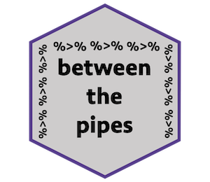

`betweenthepipes` is an R package I developed that currently holds two tutorials, created with [learnr](https://rstudio.github.io/learnr/index.html), to facilitate learning the tidyverse through hockey data. There are also two sample data sets that are used in the tutorials (and are useful for learning to work with hockey data).

First, download this package via Github: `devtools::install_github("meghall06/betweenthepipes")`.

#### Tutorial Details

- **Introduction to R with Hockey Data.** A beginner-friendly introduction to R and the tidyverse with sample hockey data. Introduces the basic tidyverse functions: filter(), select(), arrange(), filter(), mutate(), group_by(), and summarize().
- **More Data Manipulation.** Going further into data manipulation with details on pivoting data (using pivot_longer() and pivot_wider()), joining data, and working with strings.

#### How to Access Tutorials

Once the package has been downloaded, there are two options to access the tutorial. You can access each tutorial individually with the following code: 

```r
library(betweenthepipes)

intro()

data_manip()
```
Or, if you have an RStudio version 1.3 or later, there should be a Tutorial pane in the upper right corner (near Environment and Git). That pane should list all the tutorials available from the packages you've downloaded.

#### How to Access Data

There are two data sets available in this package: `pbp_example` and `bio_example`. `pbp_example` is a data set containing NHL play-by-play data for four Philadelphia Flyers games from November 2019. `bio_example` is a data set containing some NHL biographic data from 2019, useful for practicing joins with the data in `pbp_example`. More information on the data sets is available with `?betweenthepipes::bio_example` or `?betweenthepipes::pbp_example`.

#### Other Resources

In October 2020, I gave a tidyverse-focused workshop at the [Carnegie Mellon Sports Analytics Conference](http://www.stat.cmu.edu/cmsac/conference/2020/) using the data available in this package. The slides and code from the workshop are available [here](/talk/cmsac/).

#### Data Source

The play-by-play data was scraped using the [Evolving-Hockey](https://evolving-hockey.com/) [R scraper](https://github.com/evolvingwild/evolving-hockey/blob/master/EH_scrape_functions.R) and the biographic data was downloaded from [NaturalStatTrick](http://www.naturalstattrick.com/).

