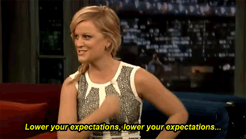

```{r setup, include=FALSE}
library(emo)
library(icons)

options(knitr.kable.NA = '')
options(htmltools.dir.version = FALSE, htmltools.preserve.raw = FALSE)
knitr::opts_chunk$set(fig.retina = 3, 
                      warning = FALSE, 
                      message = FALSE,
                      fig.path = "figs/")
```

```{r xaringan-themer, include=FALSE, warning=FALSE}
library(xaringanthemer)

style_mono_accent(
  header_font_google = google_font("Acme"),
  text_font_google   = google_font("Ubuntu", "400", "400i", "700"),
  code_font_google   = google_font("Roboto Mono"),
  link_color = "#4E3629",
  text_bold_color = "#FFC72C",
  inverse_link_color = "#FFC72C",
  base_color = "#4E3629",
  extra_fonts = list(
    google_font("Lato")
  ),
  extra_css = list(
    ".title-slide h2" = list("font-family" = "Anton"),
    ".title-slide h3" = list("font-family" = "Anton")
  )
)
```


class: inverse, left, middle

# The Power of Internal Packages
## Meghan Hall

Greater Boston useR Group<br> April 13, 2022 <br> <br> `r icons::icon_style(fontawesome("twitter", style = "brands"), scale = 1.5, fill = "white")` [@MeghanMHall](https://www.twitter.com/MeghanMHall) <br> `r icons::icon_style(fontawesome("github", style = "brands"), scale = 1.5, fill = "white")`  [meghall6](https://github.com/meghall06) <br> `r icons::icon_style(fontawesome("laptop", style = "solid"), scale = 1.5, fill = "white")` [meghan.rbind.io](https://meghan.rbind.io/)

---
layout: true
<div class="my-footer"><span>tinyurl.com/boston-user</span></div>

---

# Today's goal

```{r out.width = '45%', echo = FALSE, fig.align = "center"}
# local

```

---

# What are you talking about

.center.large[an internal package is:]
<br>

.center[
.huge[an R package, created by you, for you, to serve you and your work]
]

---

# What are you talking about

.center.large[an internal package is:]
<br>

.center[
.huge[an R package, created by **you**, for **you**, to serve **you** and your work]


.large[
**you plus a direct report**

**you plus close collaborators**

**you and your entire team**
]
]

---

# Why do I need this?

.pull-left[
> data set(s) you use in many different places
]

.pull-right[
> functions that perform regular tasks
]

<br>

.pull-left[
> calculations with important definitions
]

.pull-right[
> a common ggplot theme for decks
]

---
background-image: url(figs/emily.png)
background-size: 30%
background-position: 20% 50%
class: middle, inverse

.pull-right[
# Emily Riederer

[internal packages can: `r icons::icon_style(fontawesome("link", style = "solid"), scale = 1, fill = "#FFC72C")`](https://emilyriederer.netlify.app/post/team-of-packages/)
]

--

.pull-right[
"drive additional value if they act more like a colleague and embrace institutional knowledge"
]

--

.pull-right[
"take an opinionated stance to be more efficient and enforce best practices"
]

--

.pull-right[
"provide extremely helpful and prescriptive error messages not only explaining failure but explaining what organizational resources are needed to fix"
]

---

# How do I possibly make this

```{r out.width = '60%', echo = FALSE, fig.align = "center"}
# local

```

--

.pull-left[

`r icons::icon_style(fontawesome("ban", style = "solid"), scale = 1, fill = "FFC72C")` CRAN `r emo::ji("grimacing")`

`r icons::icon_style(fontawesome("ban", style = "solid"), scale = 1, fill = "FFC72C")` lots of unit tests

`r icons::icon_style(fontawesome("ban", style = "solid"), scale = 1, fill = "FFC72C")` a solution for every single edge case

]

--

.pull-right[

`r icons::icon_style(fontawesome("check", style = "solid"), scale = 1, fill = "FFC72C")` a single (documented!) data set

`r icons::icon_style(fontawesome("check", style = "solid"), scale = 1, fill = "FFC72C")` a single (documented!) function

`r icons::icon_style(fontawesome("check", style = "solid"), scale = 1, fill = "FFC72C")` can live on GitHub *or* just on a shared network drive!

]

---
background-image: url(figs/usethis.png)
background-size: 40%
background-position: 10% 50%
class: middle, inverse

.pull-right[
# {usethis}

[data in packages: `r icons::icon_style(fontawesome("link", style = "solid"), scale = 1, fill = "#FFC72C")`](https://rstudio4edu.github.io/rstudio4edu-book/data-pkg.html)

[functions in packages: `r icons::icon_style(fontawesome("link", style = "solid"), scale = 1, fill = "#FFC72C")`](https://r-pkgs.org/r.html)
]

--

.pull-right[
.inversecode[usethis::use_data_raw()] to load & clean data

.inversecode[usethis::use_data()] to create an .rda file

.inversecode[usethis::use_r()] to document data sets & create functions
]

---

class: center, middle, inverse

# Thank you!

Slides created via the R package [xaringan](https://github.com/yihui/xaringan).
<br>
`r icons::icon_style(fontawesome("twitter", style = "brands"), fill = "white")` [@MeghanMHall](https://www.twitter.com/MeghanMHall)
